# System architecture

## 概述

UVHTTP 是分层模块化架构，从底层到应用层依次为：

1. **传输层**：libuv 事件循环（uv_loop_t）——管理 socket、定时器、异步 I/O
2. **连接层**：uvhttp_connection_t ——连接生命周期管理、TLS 握手、读写缓冲
3. **协议层**：llhttp 解析器 + uvhttp_request/response_t ——HTTP 协议解析与响应构造
4. **路由层**：uvhttp_router_t ——URL 匹配分发（数组 + trie 树双路径）
5. **业务层**：用户注册的 handler 回调

可选模块（编译时开关）：
- websocket：WebSocket 握手 + 帧收发（RFC 6455）
- static：静态文件服务（零拷贝 sendfile）
- tls：mbedtls 封装的 TLS 1.2/1.3
- compression：gzip 压缩（LRU 缓存）
- lru_cache：通用 LRU 缓存（用于静态文件缓存）
- rate_limit：基于令牌桶的限流

## 模块图

```mermaid
graph TD
  subgraph 应用层
    H[用户 Handler]
  end
  subgraph UVHTTP 核心
    S[uvhttp_server_t] --> R[uvhttp_router_t]
    S --> C[uvhttp_connection_t]
    C --> P[llhttp 解析器]
    C --> REQ[uvhttp_request_t]
    C --> RES[uvhttp_response_t]
    R --> H
    REQ --> R
    RES --> H
  end
  subgraph 可选模块
    WS[uvhttp_websocket_t]
    ST[uvhttp_static_t]
    TLS[uvhttp_tls_t]
    GZ[uvhttp_gzip_cache_t]
    LRU[uvhttp_lru_cache_t]
    RL[限流模块]
  end
  subgraph 传输层
    UV[libuv 事件循环]
  end
  S --> WS
  S --> ST
  S --> GZ
  S --> RL
  C --> TLS
  C --> UV
```

## 约束

- **零全局变量**：所有状态通过 libuv handle->data 指针传递，支持多实例
- **编译时裁剪**：未使用的功能不编译，不增加 ROM/RAM 占用
- **缓存行对齐**：热路径结构体（request/response/connection）按 64 字节对齐，避免伪共享
- **C99 兼容**：最低 C99 标准，实际构建使用 C11，嵌入式编译器兼容
- **零拷贝路径**：大文件通过 sendfile 直接发送，不经过用户态缓冲
