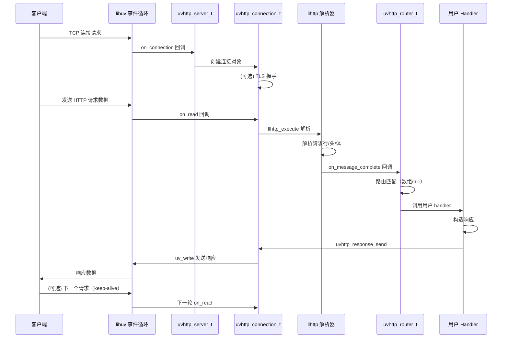

# Key flows

## 典型 HTTP 请求的端到端路径

## 关键流程

### 1. 服务器启动
1. 用户创建 `uvhttp_server_t`，绑定到 libuv `uv_loop_t`
2. 配置路由（`uvhttp_router_add_route`）和可选模块（TLS、静态文件等）
3. 调用 `uvhttp_server_listen` → `uv_tcp_bind` + `uv_listen`
4. 用户启动 `uv_run(loop, UV_RUN_DEFAULT)`

### 2. 连接建立
1. libuv 触发 `on_connection` 回调
2. `uvhttp_server_t` 创建 `uvhttp_connection_t`，分配读写缓冲区
3. 如果启用 TLS，启动 mbedtls 握手
4. 注册 `uv_read_start` 开始监听数据

### 3. HTTP 请求解析
1. libuv 触发 `on_read`，数据到达
2. 数据喂给 llhttp 解析器（`llhttp_execute`）
3. 解析器回调：`on_url`、`on_header_field`、`on_header_value`、`on_body`、`on_message_complete`
4. 构建 `uvhttp_request_t` 对象

### 4. 路由分发
1. `on_message_complete` 触发路由查找
2. `uvhttp_router_t` 按优先级查找：精确路由 → trie 路由 → 静态文件 → server handler → 404
3. 调用用户注册的 handler

### 5. 响应发送
1. 用户 handler 通过 `uvhttp_response_t` 设置状态码、头、体
2. （可选）gzip 压缩响应体（LRU 缓存命中则跳过压缩）
3. 调用 `uvhttp_response_send` 触发写操作
4. libuv 的 `uv_write` 回调处理完成通知

### 6. 连接关闭 / Keep-Alive
1. 响应发送完成后，检查 `Connection: keep-alive`
2. 如果是 keep-alive，重置解析器状态，等待下一个请求
3. 否则关闭连接，释放资源

## 其他重要流程

### WebSocket 升级
1. 用户 handler 识别到 Upgrade: websocket 请求
2. 调用 `uvhttp_connection_upgrade` 执行握手
3. 握手成功后，切换连接模式到 WebSocket
4. 后续数据直接走 WebSocket 帧解析路径

### 静态文件服务
1. 路由未命中时，检查静态文件模块
2. 路径验证 + 安全检查（防止目录遍历）
3. 小文件（<阈值）：读入内存 → 响应
4. 大文件（>1MB）：通过 sendfile 零拷贝发送
