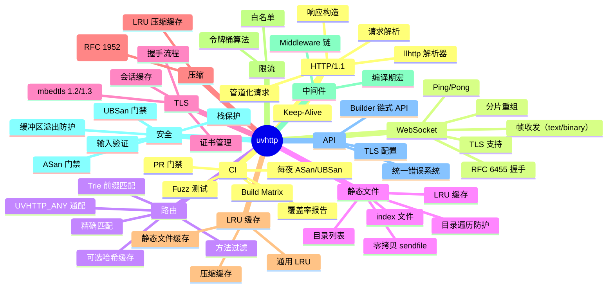

# Feature mindmap

## 功能脑图

```mermaid
mindmap
  root((uvhttp))
    HTTP/1.1
      llhttp 解析器
      请求解析
      响应构造
      Keep-Alive
      管道化请求
    WebSocket
      RFC 6455 握手
      帧收发（text/binary）
      Ping/Pong
      分片重组
      TLS 支持
    路由
      精确匹配
      Trie 前缀匹配
      方法过滤
      UVHTTP_ANY 通配
      可选哈希缓存
    静态文件
      目录遍历防护
      index 文件
      目录列表
      零拷贝 sendfile
      LRU 缓存
    TLS
      mbedtls 1.2/1.3
      证书管理
      握手流程
      会话缓存
    压缩
      gzip (RFC 1952)
      LRU 压缩缓存
    LRU 缓存
      通用 LRU
      静态文件缓存
      压缩缓存
    限流
      令牌桶算法
      白名单
    中间件
      Middleware 链
      编译期宏
    安全
      ASan 门禁
      UBSan 门禁
      缓冲区溢出防护
      输入验证
      栈保护
    API
      Builder 链式 API
      统一错误系统
      TLS 配置
    CI
      PR 门禁
      每夜 ASan/UBSan
      Fuzz 测试
      Build Matrix
      覆盖率报告
```
