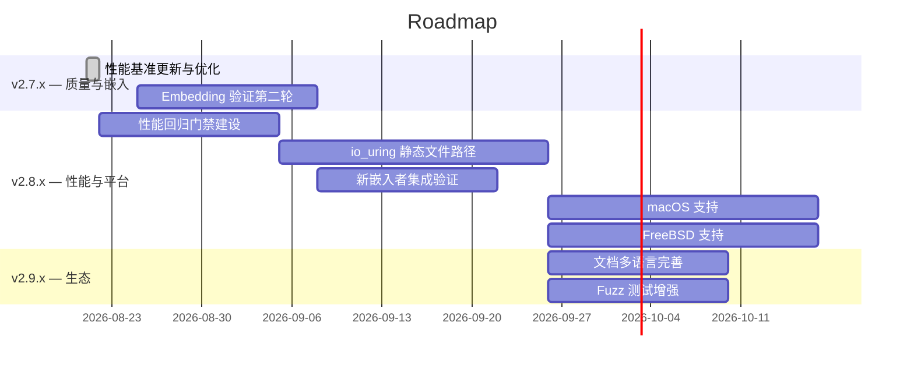

# Roadmap

## 里程碑

### v2.7.x — 质量巩固与嵌入验证（2026 Q3）

| 目标 | 优先级 | 状态 | 说明 |
|------|--------|------|------|
| TLS 会话缓存 | P0 | ✅ 已完成 | 重新启用 session cache，默认 2048 条目/24h 超时 |
| 代码质量修复 | P1 | ✅ 已完成 | 修复 L3-L5：gzip 缓存开销追踪、set_max_entries 扩容、注释拼写 |
| 性能基准更新 | P2 | ✅ 已完成 | 10 轮多轮测试，稳态 15K RPS (Silver)，峰值 33K RPS (Gold) |
| 嵌入验证第二轮 | P1 | 📋 待办 | 以 qwrt 的经验为基础，验证更多嵌入场景 |

### v2.8.x — 性能优化与平台扩展（2026 Q4）

| 目标 | 优先级 | 状态 | 说明 |
|------|--------|------|------|
| 性能回归门禁 | P0 | 📋 待办 | 建立 CI 性能回归门禁，防止性能退化 |
| io_uring 探索 | P2 | 📋 待办 | 评估 io_uring 替代 epoll 在静态文件路径中的收益 |
| 内存分配优化 | P2 | 📋 待办 | 减少热路径中的分配次数 |
| 新嵌入者接入 | P1 | 📋 待办 | 完整的嵌入式集成文档 + 示例 |
| macOS 支持 | P3 | 📋 待办 | kqueue 适配、sendfile 兼容、CI 测试 |
| FreeBSD 支持 | P3 | 📋 待办 | kqueue 已有经验，适配 FreeBSD 差异 |

### v2.9.x — 生态扩展（2027 Q1）

| 目标 | 优先级 | 状态 | 说明 |
|------|--------|------|------|
| 文档完善 | P1 | 📋 待办 | 中文文档同步、API 参考补充 |
| Fuzz 测试增强 | P1 | 📋 待办 | 扩展 fuzz 测试覆盖更多协议路径 |
| 社区贡献指南 | P1 | 📋 待办 | 完善 CONTRIBUTING.md、代码评审流程 |

### 完成项（v2.6.x + v2.7.0）

- ✅ HTTP/1.1 服务器（稳态 ~15K RPS / 峰值 ~33K RPS）
- ✅ WebSocket 全双工通信（RFC 6455）
- ✅ TLS 1.2/1.3（mbedtls）
- ✅ TLS 会话缓存（默认 2048 条目/24h，可配置）
- ✅ 零拷贝静态文件（sendfile）
- ✅ LRU 缓存（静态文件 + 压缩）
- ✅ gzip 压缩（RFC 1952）
- ✅ 32-bit 嵌入式支持
- ✅ 限流（令牌桶 + 白名单）
- ✅ ASan/UBSan CI 门禁（101/101 测试通过）
- ✅ 编译时裁剪（36 个选项）
- ✅ 统一错误系统
- ✅ 构建矩阵验证（Build Matrix）
- ✅ 嵌入验证清单
- ✅ 设计哲学文档
- ✅ Brain 知识库文档
- ✅ 代码质量修复（L3-L5）
- ✅ 性能基准更新（10 轮多轮测试，稳态 Silver / 峰值 Gold）
