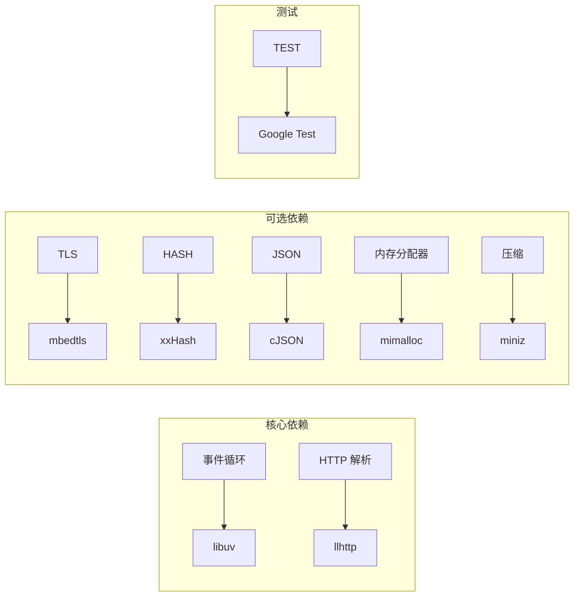

# Tech stack

## 技术选型

| 领域 | 候选 | 决策 | 理由 |
|------|------|------|------|
| **事件循环** | libuv, libevent, hand-written epoll | **libuv** | 跨平台、活跃维护、与 Node.js 同生态；嵌入式 Linux 主流选择 |
| **HTTP 解析器** | llhttp, http-parser, hand-written | **llhttp** | 生成式解析器，无运行时开销；Node.js 官方使用；比 http-parser 更安全 |
| **TLS** | mbedtls, OpenSSL, BoringSSL | **mbedtls** | 嵌入式优先、小体积（~50KB vs OpenSSL ~2MB）、C 语言 API 简洁 |
| **哈希** | xxHash, CityHash, FarmHash, SHA-系列 | **xxHash** | 极快（~50GB/s 流水线）、质量好、广泛使用、零依赖 |
| **JSON** | cJSON, jansson, parson | **cJSON** | 轻量（~1KB）、公共领域、单文件、零依赖 |
| **内存分配器** | mimalloc, jemalloc, tcmalloc, glibc malloc | **mimalloc (可选)** | 微软维护、嵌入友好、比 glibc malloc 快 30-60%、比 jemalloc 小 3x |
| **压缩** | zlib, miniz, zstd | **miniz (默认)** | 单文件、zlib 兼容、嵌入式友好、无外部依赖 |
| **测试框架** | Google Test, Unity, Criterion | **Google Test** | 行业标准、断言丰富、参数化测试支持、C++ 方便 mock |

## 选型决策图

## 开放项目

- **macOS 支持**：libuv 在 macOS 上工作，但 UVHTTP 的 sendfile 路径和 epoll 特定代码需要适配 kqueue
- **ROUTER_CACHE 模块**：存在 ABI 不兼容问题（PR #349 已修复编译问题，但仍有设计缺陷），建议不使用
- **io_uring 集成**：未来可考虑将静态文件路径迁移到 io_uring 以获得更好的异步 I/O 性能
