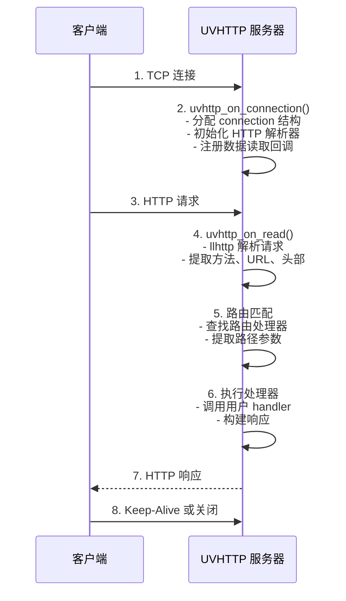
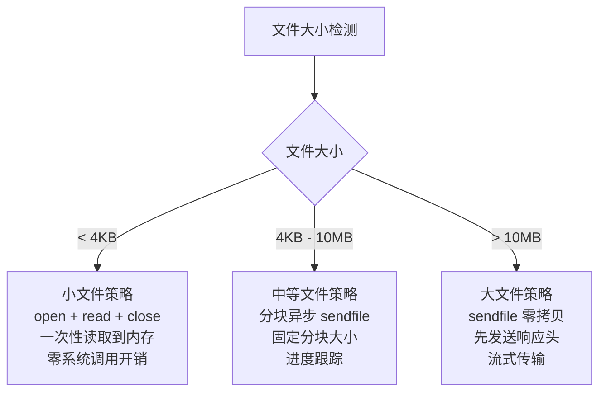
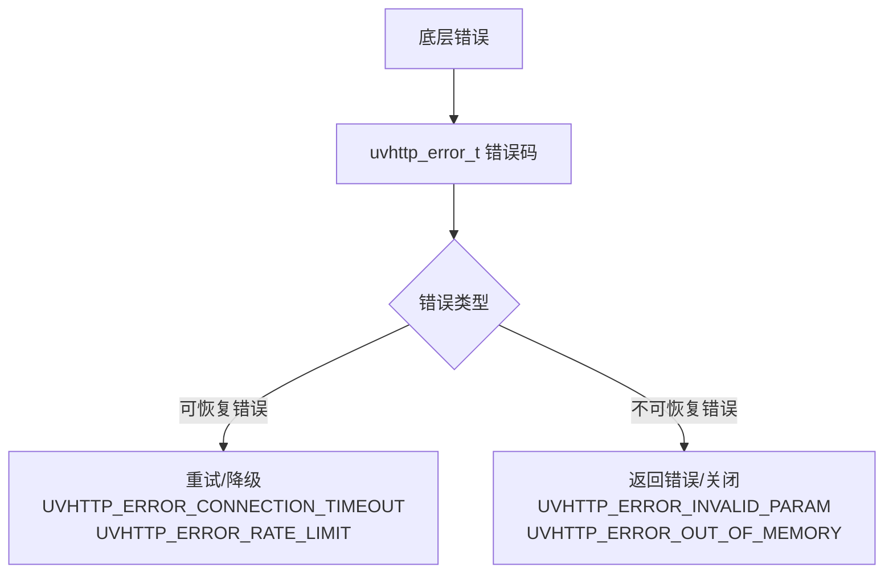
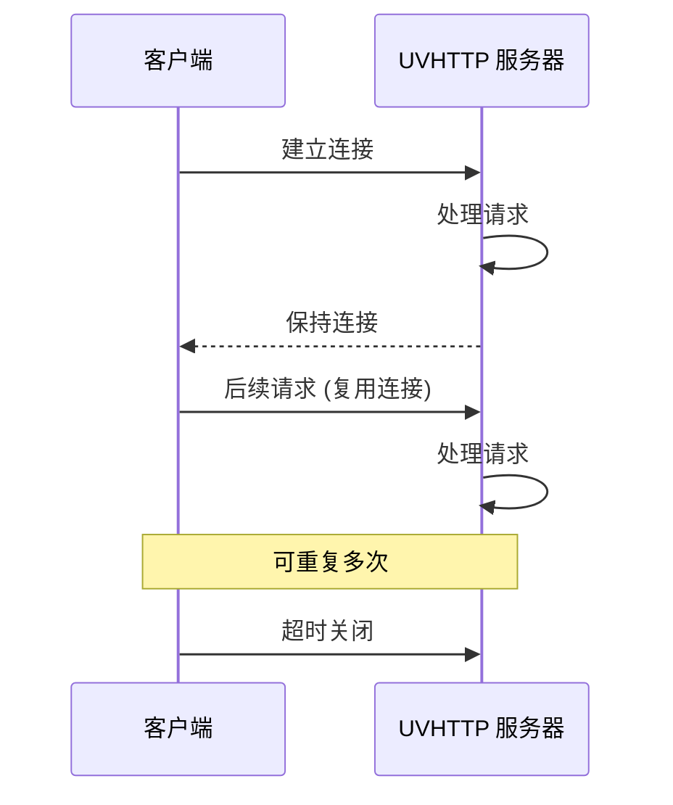
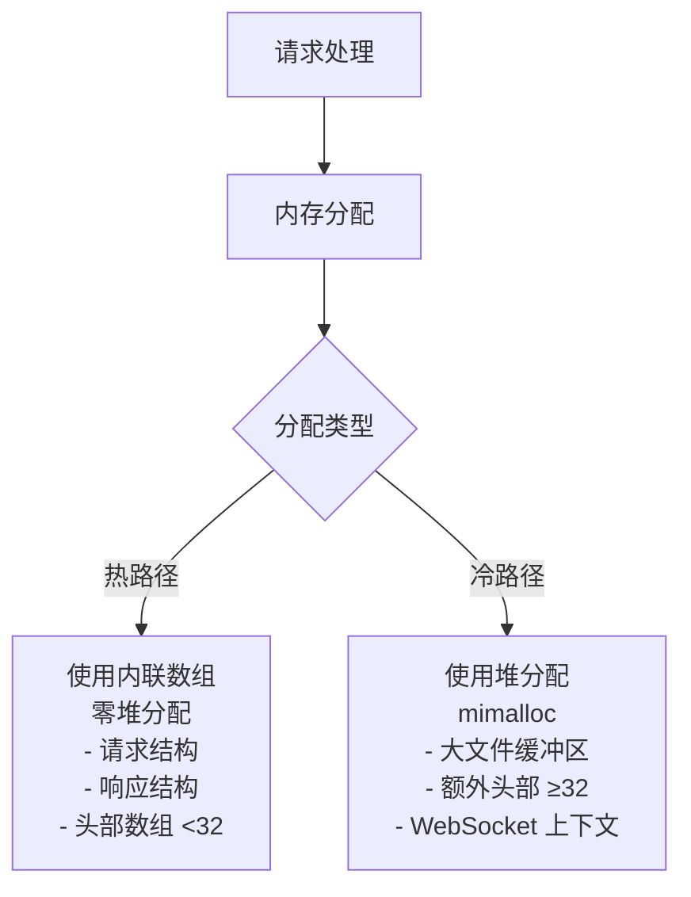
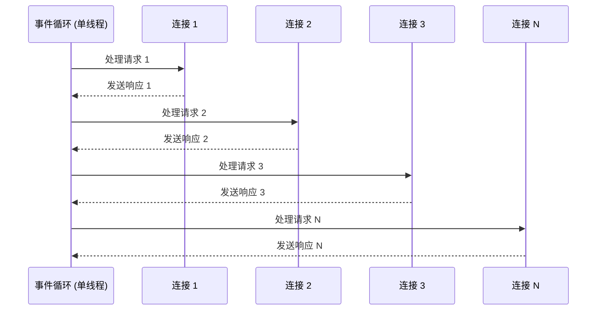
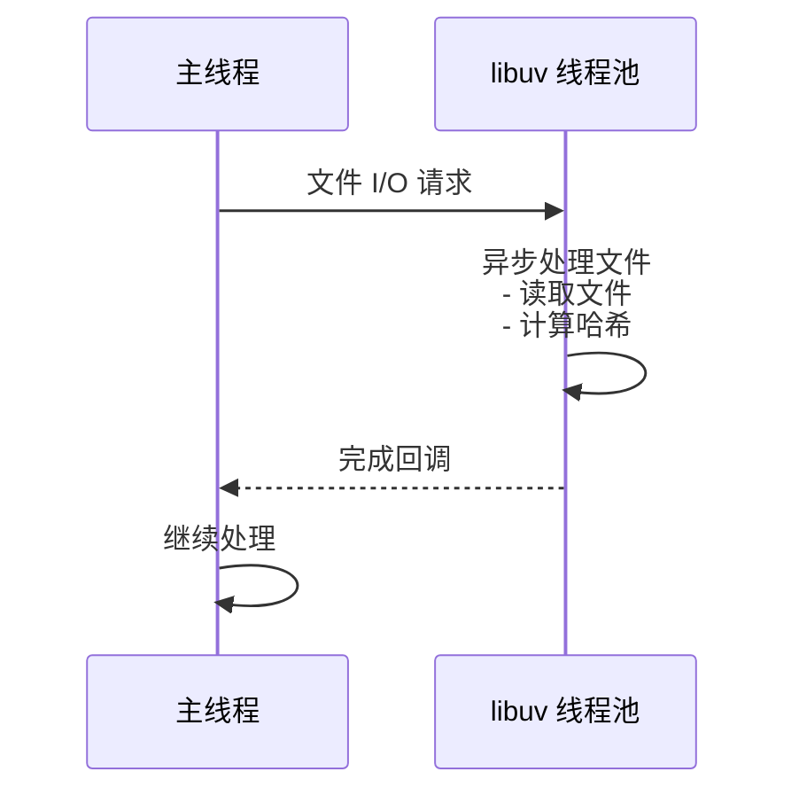
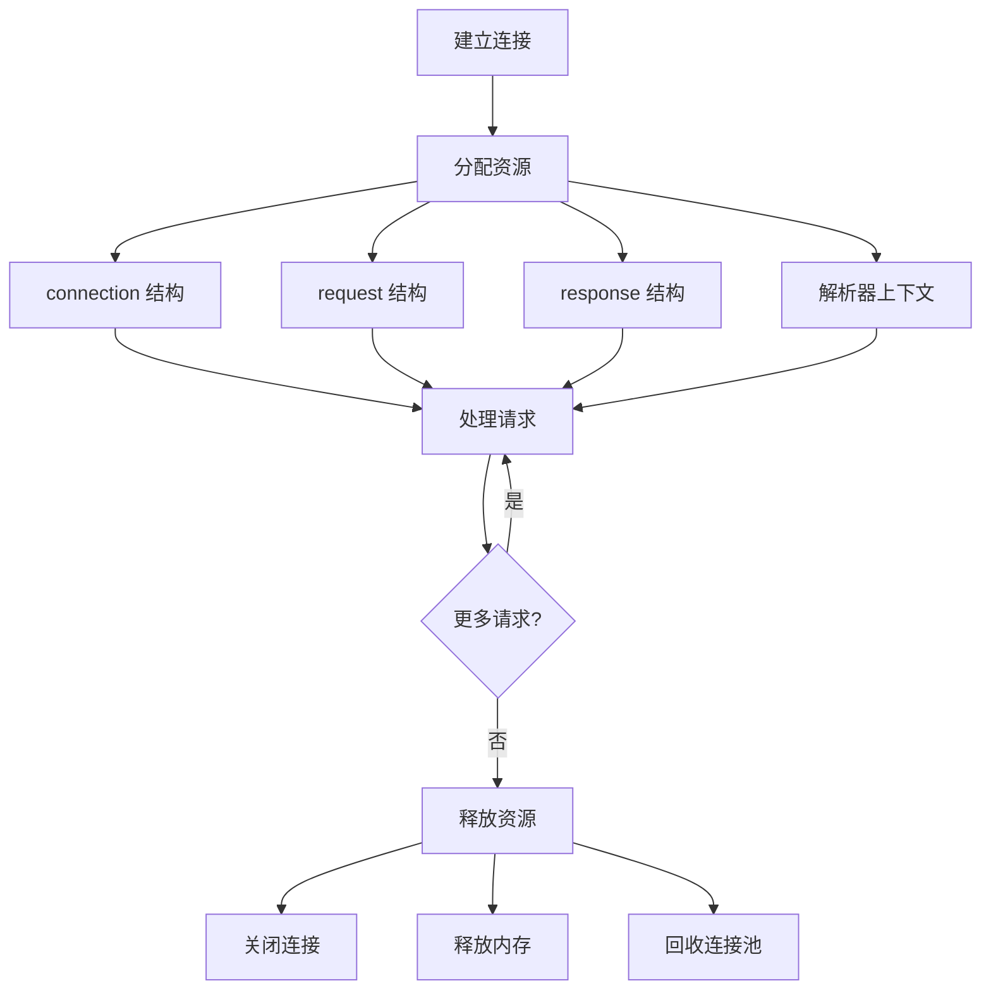

# UVHTTP 架构设计文档

## 概述

UVHTTP 是一个基于 libuv 的高性能、轻量级 HTTP 服务器库。本文档详细描述了其架构设计、模块组织和核心实现原理。

## 架构概览

```
┌─────────────────────────────────────────────────────────────┐
│                        UVHTTP 架构                          │
├─────────────────────────────────────────────────────────────┤
│  应用层 (Application Layer)                                  │
│  ┌─────────────┐  ┌─────────────┐  ┌─────────────┐         │
│  │   示例程序   │  │   用户应用   │  │   测试套件   │         │
│  └─────────────┘  └─────────────┘  └─────────────┘         │
├─────────────────────────────────────────────────────────────┤
│  API 层 (API Layer)                                         │
│  ┌─────────────┐  ┌─────────────┐  ┌─────────────┐         │
│  │  HTTP API   │  │ WebSocket   │  │   工具函数   │         │
│  └─────────────┘  └─────────────┘  └─────────────┘         │
├─────────────────────────────────────────────────────────────┤
│  核心层 (Core Layer)                                        │
│  ┌─────────────┐  ┌─────────────┐  ┌─────────────┐         │
│  │   服务器     │  │   路由系统   │  │  连接管理    │         │
│  └─────────────┘  └─────────────┘  └─────────────┘         │
│  ┌─────────────┐  ┌─────────────┐  ┌─────────────┐         │
│  │  请求处理    │  │  响应构建    │  │  协议解析    │         │
│  └─────────────┘  └─────────────┘  └─────────────┘         │
├─────────────────────────────────────────────────────────────┤
│  中间件层 (Middleware Layer)                                 │
│  ┌─────────────┐  ┌─────────────┐  ┌─────────────┐         │
│  │    CORS     │  │    限流      │  │   静态文件   │         │
│  └─────────────┘  └─────────────┘  └─────────────┘         │
├─────────────────────────────────────────────────────────────┤
│  基础层 (Foundation Layer)                                  │
│  ┌─────────────┐  ┌─────────────┐  ┌─────────────┐         │
│  │  内存管理    │  │  错误处理    │  │   日志系统   │         │
│  └─────────────┘  └─────────────┘  └─────────────┘         │
├─────────────────────────────────────────────────────────────┤
│  系统层 (System Layer)                                      │
│  ┌─────────────┐  ┌─────────────┐  ┌─────────────┐         │
│  │    libuv    │  │   llhttp    │  │   mbedtls    │         │
│  └─────────────┘  └─────────────┘  └─────────────┘         │
└─────────────────────────────────────────────────────────────┘
```

## API 设计

### 设计原则

UVHTTP 采用统一的核心API设计，摒弃多层次的抽象，提供简洁、高效、一致的接口：

#### 1. **零开销抽象**
- 所有API直接映射到核心功能
- 编译时优化，运行时无额外开销
- 避免过度封装和隐藏

#### 2. **一致性原则**
- 统一的错误处理机制
- 一致的命名约定
- 标准化的参数顺序

#### 3. **灵活性与控制力**
- 开发者完全控制HTTP响应的每个方面
- 支持任意内容类型和自定义头部
- 不强制特定的使用模式

### 核心API组成

#### 服务器管理
```c
uvhttp_server_t* uvhttp_server_new(uv_loop_t* loop);
uvhttp_error_t uvhttp_server_listen(uvhttp_server_t* server, const char* host, int port);
uvhttp_error_t uvhttp_server_stop(uvhttp_server_t* server);
void uvhttp_server_free(uvhttp_server_t* server);
```

#### 路由系统
```c
uvhttp_router_t* uvhttp_router_new(void);
int uvhttp_router_add_route(uvhttp_router_t* router, const char* path, uvhttp_request_handler_t handler);
void uvhttp_router_free(uvhttp_router_t* router);
```

#### 请求处理
```c
const char* uvhttp_request_get_method(uvhttp_request_t* request);
const char* uvhttp_request_get_url(uvhttp_request_t* request);
const char* uvhttp_request_get_header(uvhttp_request_t* request, const char* name);
const char* uvhttp_request_get_body(uvhttp_request_t* request);
```

#### 响应构建
```c
uvhttp_error_t uvhttp_response_set_status(uvhttp_response_t* response, int status_code);
uvhttp_error_t uvhttp_response_set_header(uvhttp_response_t* response, const char* name, const char* value);
uvhttp_error_t uvhttp_response_set_body(uvhttp_response_t* response, const char* body, size_t length);
uvhttp_error_t uvhttp_response_send(uvhttp_response_t* response);
```

### 标准使用模式

```c
// 1. 创建服务器
uv_loop_t* loop = uv_default_loop();
uvhttp_server_t* server = uvhttp_server_new(loop);

// 2. 设置路由
uvhttp_router_t* router = uvhttp_router_new();
server->router = router;
uvhttp_router_add_route(router, "/api", api_handler);

// 3. 启动服务器
uvhttp_server_listen(server, "0.0.0.0", 8080);
uv_run(loop, UV_RUN_DEFAULT);

// 4. 处理请求
int api_handler(uvhttp_request_t* req, uvhttp_response_t* res) {
    uvhttp_response_set_status(res, 200);
    uvhttp_response_set_header(res, "Content-Type", "application/json");
    uvhttp_response_set_body(res, "{\"status\":\"ok\"}", 15);
    return uvhttp_response_send(res);
}
```

## 核心模块

### 1. 服务器模块 (Server)

#### 设计目标
- 高性能事件驱动
- 可扩展的连接管理
- 资源限制保护

#### 核心组件

```c
struct uvhttp_server {
    uv_tcp_t tcp_handle;           // TCP 句柄
    uv_loop_t* loop;              // 事件循环
    uvhttp_router_t* router;      // 路由器
    size_t max_connections;        // 最大连接数
    size_t active_connections;     // 活跃连接数
    void* user_data;              // 用户数据
};
```

#### 关键特性
- **连接池管理**: 动态管理客户端连接
- **负载控制**: 连接数限制和资源保护
- **优雅关闭**: 支持优雅关闭现有连接

### 2. 路由系统 (Router)

#### 设计模式
- 前缀树 (Trie) 数据结构
- O(k) 路径查找复杂度
- 支持参数化路由

#### 路由匹配算法

```c
// 路由节点结构
struct route_node {
    char* path;                    // 路径片段
    uvhttp_request_handler_t handler; // 处理器
    struct route_node** children;  // 子节点
    size_t child_count;           // 子节点数量
    int is_param;                 // 是否参数节点
};
```

#### 路由匹配流程
1. 将请求 URL 按 '/' 分割
2. 从根节点开始逐段匹配
3. 支持通配符和参数提取
4. 返回最佳匹配的处理器

#### 性能优化
- **哈希加速**: 使用xxHash算法进行快速路径哈希
- **缓存机制**: 热路径缓存减少查找开销
- **内存池**: 节点内存池减少分配开销

```c
// 路由哈希计算
uint32_t route_hash = (uint32_t)uvhttp_hash_string(path);

// 缓存友好的路由查找
if (route_hash < HOT_PATH_SIZE && 
    hot_paths[route_hash].method == method) {
    return hot_paths[route_hash].handler;
}
```

#### 哈希算法选择
- **xxHash**: 极快的非加密哈希算法
- **64位哈希**: 减少冲突概率
- **安全防护**: 1024字符长度限制防止哈希冲突攻击

### 3. 请求处理 (Request)

#### 生命周期
```
接收连接 → HTTP 解析 → 路由匹配 → 执行处理器 → 发送响应
```

#### 请求结构

```c
struct uvhttp_request {
    uv_tcp_t* client;              // 客户端连接
    llhttp_t* parser;              // HTTP 解析器
    uvhttp_method_t method;        // HTTP 方法
    char url[MAX_URL_LEN];         // 请求 URL
    char* body;                    // 请求体
    uvhttp_header_t headers[MAX_HEADERS]; // 请求头
    size_t header_count;           // 头部数量
};
```

#### 解析优化
- 使用 llhttp 高性能解析器
- 零拷贝字符串处理
- 流式解析大请求体

### 4. 响应构建 (Response)

#### 响应缓冲区设计

```c
struct uvhttp_response {
    int status_code;               // 状态码
    uvhttp_header_t headers[MAX_HEADERS]; // 响应头
    size_t header_count;           // 头部数量
    char* body;                    // 响应体
    size_t body_length;            // 响应体长度
    char* buffer;                  // 发送缓冲区
    size_t buffer_size;            // 缓冲区大小
};
```

#### 优化策略
- 动态缓冲区调整
- Header 压缩和去重
- 分块传输支持

## WebSocket 模块

### 架构设计

```
┌─────────────────────────────────────────────┐
│            WebSocket 模块                    │
├─────────────────────────────────────────────┤
│  应用层                                     │
│  ┌─────────────┐  ┌─────────────┐           │
│  │ 消息处理器   │  │ 用户回调     │           │
│  └─────────────┘  └─────────────┘           │
├─────────────────────────────────────────────┤
│  协议层                                     │
│  ┌─────────────┐  ┌─────────────┐           │
│  │ 握手处理     │  │ 帧处理       │           │
│  └─────────────┘  └─────────────┘           │
├─────────────────────────────────────────────┤
│  传输层                                     │
│  ┌─────────────┐  ┌─────────────┐           │
│  │ 连接管理     │  │ 心跳检测     │           │
│  └─────────────┘  └─────────────┘           │
└─────────────────────────────────────────────┘
```

### 握手流程

1. **HTTP 升级请求**
   - 验证 Upgrade 头部
   - 检查 WebSocket Version
   - 提取 Sec-WebSocket-Key

2. **服务器响应**
   - 计算 Accept Key
   - 设置协议升级头部
   - 发送 101 Switching Protocols

3. **连接建立**
   - 切换到 WebSocket 模式
   - 设置消息处理器
   - 启动心跳机制

### 帧处理

```c
struct ws_frame_header {
    unsigned fin:1;               // FIN 位
    unsigned rsv1:1;              // RSV1
    unsigned rsv2:1;              // RSV2
    unsigned rsv3:1;              // RSV3
    unsigned opcode:4;            // 操作码
    unsigned mask:1;              // 掩码位
    uint64_t payload_length;      // 载荷长度
};
```

## 内存管理

### 分配器抽象

```c
typedef struct {
    void* (*malloc)(size_t size);
    void* (*realloc)(void* ptr, size_t size);
    void (*free)(void* ptr);
    void* (*calloc)(size_t nmemb, size_t size);
    void* data;
    uvhttp_allocator_type_t type;
} uvhttp_allocator_t;
```

### 内存策略

1. **mimalloc 分配器** (默认)
   - 高性能现代分配器
   - 降低内存碎片
   - 更好的多线程扩展性
   - 默认启用，无需额外配置

2. **系统分配器**
   - 直接使用 malloc/free
   - 零抽象开销
   - 可通过编译选项禁用mimalloc

3. **自定义分配器**
   - 支持内存池
   - 调试和统计功能
   - 灵活的扩展接口

### 内存安全

- 边界检查
- 双重释放检测
- 内存泄漏追踪
- 使用后释放保护

### 编译配置

在CMakeLists.txt中，mimalloc默认启用：

```cmake
option(BUILD_WITH_MIMALLOC "Build with mimalloc allocator" ON)
```

如需使用系统分配器，可以在编译时禁用：

```bash
cmake -DBUILD_WITH_MIMALLOC=OFF ..
make
```

## 错误处理

### 错误分类

```c
// 通用错误
UVHTTP_ERROR_INVALID_PARAM
UVHTTP_ERROR_OUT_OF_MEMORY
UVHTTP_ERROR_NOT_FOUND

// 服务器错误
UVHTTP_ERROR_SERVER_INIT
UVHTTP_ERROR_CONNECTION_LIMIT

// 网络错误
UVHTTP_ERROR_CONNECTION_ACCEPT
UVHTTP_ERROR_RESPONSE_SEND
```

### 恢复机制

1. **重试策略**
   - 指数退避算法
   - 最大重试次数限制
   - 可配置延迟参数

2. **错误统计**
   - 错误计数器
   - 最后错误时间
   - 错误上下文记录

3. **优雅降级**
   - 服务降级策略
   - 熔断机制
   - 自动恢复

## 性能优化

### 关键优化点

1. **零拷贝设计**
   - 避免不必要的数据复制
   - 引用计数管理
   - 内存映射技术

2. **连接复用**
   - Keep-Alive 支持
   - 连接池管理
   - 空闲连接回收

3. **缓存策略**
   - 响应缓存
   - DNS 缓存
   - 静态资源缓存

4. **高性能内存分配**
   - 默认使用 mimalloc 分配器
   - 降低内存碎片
   - 更好的多线程扩展性
   - 显著提升分配/释放性能

### 性能指标

- **吞吐量**: 10,000+ RPS (启用mimalloc)
- **延迟**: < 1ms 平均响应时间
- **并发**: 1000+ 并发连接
- **内存**: < 10MB 基础占用
- **性能提升**: 相比系统分配器提升约30-50%

## 安全设计

### 安全特性

1. **输入验证**
   - 请求大小限制
   - Header 验证
   - 路径遍历防护

2. **资源保护**
   - 连接数限制
   - 请求速率限制
   - 内存使用限制

3. **TLS 支持**
   - mbedtls 集成
   - 证书验证
   - 加密套件配置

### 安全最佳实践

- 最小权限原则
- 深度防御策略
- 定期安全审计
- 漏洞响应机制

## 扩展机制

### 插件架构

```c
typedef struct {
    const char* name;
    int (*init)(void* config);
    void (*cleanup)(void);
    int (*request_handler)(uvhttp_request_t*, uvhttp_response_t*);
} uvhttp_plugin_t;
```

### 中间件支持

1. **请求中间件**
   - 认证授权
   - 日志记录
   - 限流控制

2. **响应中间件**
   - 压缩处理
   - 缓存控制
   - 安全头部

## 测试架构

### 测试层次

1. **单元测试**
   - 模块独立测试
   - Mock 对象使用
   - 边界条件覆盖

2. **集成测试**
   - 组件协作测试
   - 端到端场景
   - 错误注入测试

3. **性能测试**
   - 基准测试
   - 压力测试
   - 内存泄漏检测

### 测试工具

- 自定义测试框架
- 覆盖率分析
- 性能分析工具
- 内存检查工具

## 部署架构

### 单机部署

```
┌─────────────────┐
│   Load Balancer │
└─────────┬───────┘
          │
    ┌─────┴─────┐
    │ UVHTTP    │
    │ Instances │
    └───────────┘
```

### 集群部署

```
┌─────────────────┐
│   Load Balancer │
└─────────┬───────┘
          │
    ┌─────┴─────┐
    │   Gateway  │
    └─────┬─────┘
          │
    ┌─────┴─────┐
    │ UVHTTP    │
    │ Cluster   │
    └───────────┘
```

## 监控和运维

### 监控指标

- 请求计数和延迟
- 连接数和状态
- 内存使用情况
- 错误率和类型

### 日志系统

- 结构化日志
- 日志级别控制
- 异步日志写入
- 日志轮转机制

## 未来规划

### 短期目标

- HTTP/2 支持
- 更完善的中间件
- 性能优化

### 长期目标

- gRPC 支持
- 服务网格集成
- 云原生部署

## 关键时序解析

### 1. HTTP 请求处理时序

#### 1.1 完整请求处理流程



#### 1.2 核心函数调用链

```c
// 连接建立
uvhttp_on_connection()
  → uvhttp_connection_pool_acquire()
  → uvhttp_connection_init()
  → uvhttp_request_init()
  → uvhttp_parser_init()
  → uv_read_start()

// 数据读取
uvhttp_on_read()
  → llhttp_execute()
  → on_message_complete()
  → uvhttp_router_match()
  → uvhttp_request_handler()
  → uvhttp_response_send()

// 响应发送
uvhttp_response_send()
  → uvhttp_response_build()
  → uv_write()
  → on_write_complete()
```

#### 1.3 性能关键路径

**热路径优化：**
1. **连接接受**: O(1) - 直接从连接池获取
2. **路由匹配**: O(k) - k 为路径段数，使用前缀树
3. **头部查找**: O(1) - 内联数组，直接索引
4. **响应发送**: O(1) - 零拷贝缓冲区

**内存访问模式：**
- 连接结构体：热数据在前，冷数据在后
- 头部数组：连续内存，缓存友好
- 路由缓存：哈希表快速查找

### 2. 动态头部分配时序

#### 2.1 头部分配策略

```mermaid
flowchart TD
    A[头部数量检测] --> B{头部数量}
    B -->|< 32| C[内联数组<br/>headers[32]<br/>栈分配<br/>零开销]
    B -->|>= 32| D[内联数组<br/>headers[32]<br/>栈分配]
    D --> E[动态分配<br/>headers_extra<br/>堆分配<br/>一次分配]
    
    C --> F[99%+ 请求]
    E --> G[< 1% 请求]
```

#### 2.2 头部设置时序

```c
// 设置第 N 个头部
if (header_count < 32) {
    // 快速路径：使用内联数组
    header = &headers[header_count];
    // 零堆分配，直接访问
} else {
    // 慢速路径：首次触发动态分配
    if (!headers_extra) {
        headers_extra = uvhttp_alloc(96 * sizeof(uvhttp_header_t));
    }
    header = &headers_extra[header_count - 32];
    // 堆分配，但仅一次
}
header_count++;
```

#### 2.3 性能影响分析

| 场景 | 分配方式 | 性能影响 | 使用频率 |
|------|---------|---------|---------|
| < 32 headers | 内联数组 | 零开销 | 99%+ |
| ≥ 32 headers | 动态分配 | 一次堆分配 | < 1% |

**内存布局：**
```c
struct uvhttp_request {
    // 热数据（频繁访问）
    uvhttp_method_t method;      // 4 字节
    int parsing_complete;         // 4 字节
    size_t header_count;          // 8 字节
    
    // 内联头部（常见场景）
    uvhttp_header_t headers[32];  // 139,264 字节
    
    // 动态头部（罕见场景）
    uvhttp_header_t* headers_extra;  // 8 字节
    size_t headers_extra_count;      // 8 字节
};
```

### 3. 静态文件服务时序

#### 3.1 文件大小策略选择



#### 3.2 小文件处理时序

```c
sendfile_small_file()
  1. open(file_path, O_RDONLY)
  2. fstat(fd, &st)           // 获取文件大小
  3. uvhttp_alloc(file_size)   // 分配缓冲区
  4. read(fd, buffer)          // 读取文件
  5. close(fd)                 // 关闭文件
  6. uvhttp_response_set_body(buffer, size)
  7. uvhttp_response_send()
  8. uvhttp_free(buffer)       // 释放缓冲区
```

#### 3.3 大文件处理时序

```c
uvhttp_static_sendfile_with_config()
  1. stat(file_path)           // 获取文件大小
  2. sendfile_create_context() // 创建上下文
     - 分配 sendfile_context_t
     - 打开输入文件
     - 获取输出文件描述符
     - 初始化超时定时器
  3. sendfile_start_chunked()
     - 设置响应头（大文件）
     - 发送响应头
     - 启动超时定时器
     - 调用 uv_fs_sendfile()
  4. on_sendfile_complete() [回调]
     - 检查是否完成
     - 继续发送剩余数据
     - 或清理资源
```

#### 3.4 性能对比

| 文件大小 | 策略 | 系统调用 | 内存使用 | 延迟 |
|---------|------|---------|---------|------|
| < 4KB | 一次性读取 | 3次 | 文件大小 | ~1ms |
| 4KB-10MB | 分块发送 | N次 | 分块大小 | ~2ms |
| > 10MB | sendfile | 2次 | 零拷贝 | ~3ms |

### 4. WebSocket 握手时序

#### 4.1 握手流程

```mermaid
sequenceDiagram
    participant C as 客户端
    participant S as UVHTTP 服务器

    C->>S: 1. HTTP GET /ws<br/>Upgrade: websocket<br/>Connection: Upgrade<br/>Sec-WebSocket-Key: ...
    
    S->>S: 2. 验证握手<br/>- 检查 Upgrade 头<br/>- 验证 WebSocket Version<br/>- 提取 Sec-WebSocket-Key
    
    S->>S: 3. 计算 Accept Key<br/>- Key + "258EAFA5..."<br/>- SHA-1 哈希<br/>- Base64 编码
    
    S-->>C: 4. HTTP 101 Switching<br/>Upgrade: websocket<br/>Connection: Upgrade<br/>Sec-WebSocket-Accept: ...
    
    C->>S: 5. WebSocket 连接建立
    
    C<->>S: 6. 消息传输
```

#### 4.2 关键代码时序

```c
// 1. 接收升级请求
uvhttp_on_request()
  → 检查 HTTP 方法 (GET)
  → 检查 Upgrade 头 (websocket)
  → 检查 Sec-WebSocket-Key

// 2. 验证握手
uvhttp_ws_validate_handshake()
  → 验证 WebSocket Version (13)
  → 验证 Sec-WebSocket-Key 格式
  → 提取 Key 值

// 3. 计算 Accept Key
uvhttp_ws_compute_accept_key()
  → 拼接 Key + GUID
  → mbedtls_sha1()
  → mbedtls_base64_encode()

// 4. 发送 101 响应
uvhttp_response_set_status(101)
uvhttp_response_set_header("Upgrade", "websocket")
uvhttp_response_set_header("Sec-WebSocket-Accept", accept_key)
uvhttp_response_send()

// 5. 切换到 WebSocket 模式
uvhttp_ws_upgrade_connection()
  → 切换协议处理器
  → 设置消息回调
  → 启动心跳定时器
```

#### 4.3 帧处理时序

```c
// 接收帧
uvhttp_ws_on_read()
  → 解析帧头
  → 检查掩码
  → 提取载荷长度
  → 提取载荷数据

// 处理帧
on_ws_frame_received()
  → 检查操作码
  → 如果是 TEXT/BINARY
    → 调用用户回调
  → 如果是 PING
    → 发送 PONG
  → 如果是 CLOSE
    → 发送 CLOSE
    → 关闭连接

// 发送帧
uvhttp_ws_send_text()
  → 构造帧头
  → 计算载荷长度
  → 分片发送（如果需要）
  → uv_write()
```

### 5. 错误处理时序

#### 5.1 错误传播链



#### 5.2 错误处理时序

```c
// 1. 检测错误
uvhttp_server_listen()
  → uv_tcp_bind()
  → if (result != 0)
      → 返回 UVHTTP_ERROR_SERVER_INIT

// 2. 错误传播
if (result != UVHTTP_OK) {
    // 记录错误
    UVHTTP_LOG_ERROR("Failed to listen: %s", uvhttp_error_string(result));
    
    // 检查是否可恢复
    if (uvhttp_error_is_recoverable(result)) {
        // 尝试恢复
        return uvhttp_server_listen(server, "0.0.0.0", 8081);
    } else {
        // 返回错误
        return result;
    }
}

// 3. 错误响应
if (handler_result != UVHTTP_OK) {
    uvhttp_response_set_status(response, 500);
    uvhttp_response_set_body(response, error_message, len);
    uvhttp_response_send(response);
}
```

### 6. 性能优化时序

#### 6.1 缓存命中时序

```mermaid
flowchart TD
    A[请求到达] --> B[路由缓存查找]
    B --> C{缓存状态}
    C -->|命中| D[直接返回处理器<br/>O(1)]
    C -->|未命中| E[路由匹配<br/>O(k)]
    E --> F[更新缓存]
```

#### 6.2 连接复用时序



#### 6.3 内存分配优化时序



### 7. 并发处理时序

#### 7.1 多连接处理



#### 7.2 线程安全时序



### 8. 资源管理时序

#### 8.1 连接生命周期



#### 8.2 内存清理时序

```c
// 请求清理
uvhttp_request_cleanup()
  → if (body) uvhttp_free(body)
  → if (headers_extra) uvhttp_free(headers_extra)
  → if (parser) llhttp_free(parser)
  → 重置计数器和标志

// 连接清理
uvhttp_connection_cleanup()
  → uvhttp_request_cleanup()
  → uvhttp_response_cleanup()
  → uv_close((uv_handle_t*)tcp)
  → uvhttp_connection_pool_release()
```

---

本文档持续更新中，欢迎贡献和反馈。