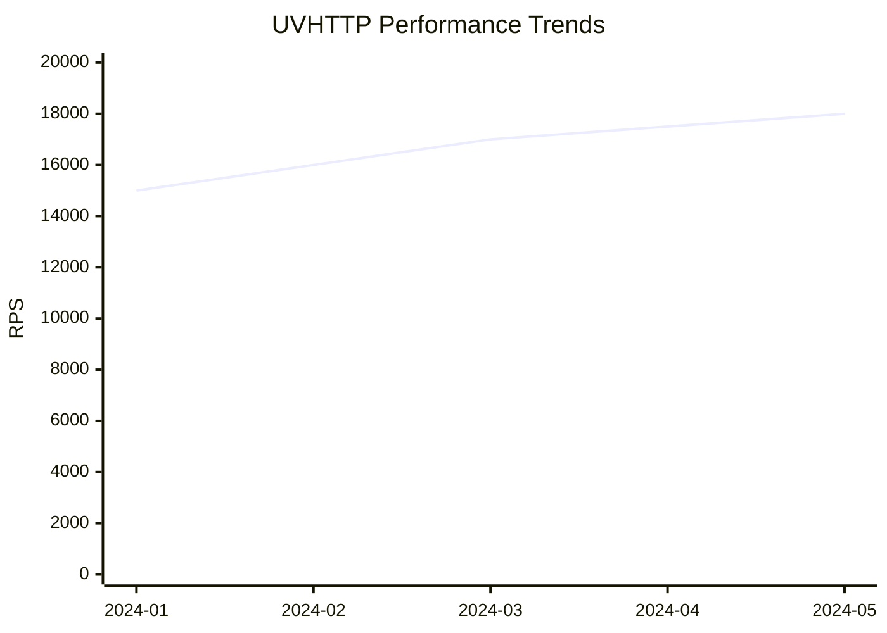
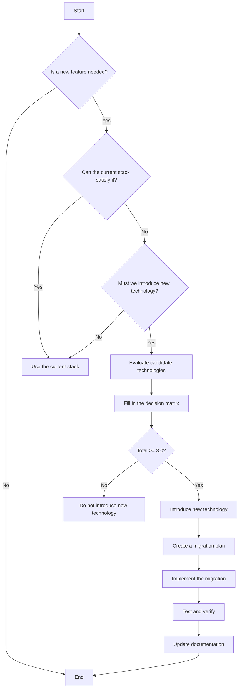

# UVHTTP Engineering Standards

> Version: 2.2.1  
> Updated: 2026-02-01  
> Status: Released

## Table of Contents

1. [Overview](#overview)
2. [Code Style Standards](#code-style-standards)
3. [Compilation Standards](#compilation-standards)
4. [Memory Management Standards](#memory-management-standards)
5. [Error Handling Standards](#error-handling-standards)
6. [Testing Standards](#testing-standards)
7. [Commit Standards](#commit-standards)
8. [Performance Standards](#performance-standards)
9. [Documentation Standards](#documentation-standards)
10. [Security Standards](#security-standards)
11. [Architectural Design Principles](#architectural-design-principles)
12. [Technology Stack Selection Standards](#technology-stack-selection-standards)

---

## Overview

UVHTTP is a C99 HTTP/1.1 and WebSocket server library built on libuv. This document defines the engineering standards applied during project development.

### Core Design Principles

- **Focus on the core**: implement only HTTP protocol handling, with no built-in business logic
- **Zero overhead**: no abstraction-layer cost in production
- **Minimalist engineering**: remove unnecessary complexity
- **Test separation**: test code separated from production code
- **Zero global variables**: supports multiple instances and unit testing
- **Production ready**: error handling and resource management

---

## Code Style Standards

### C Language Standard

- **Standard version**: C99
- **Minimum requirement**: a compiler supporting C99 (GCC 4.8+, Clang 3.3+)
- **Compiler requirement**:
  ```cmake
  set(CMAKE_C_STANDARD 11)
  set(CMAKE_C_STANDARD_REQUIRED ON)
  ```

### Indentation and Formatting

- **Indentation**: 4 spaces, no tabs
- **Line width limit**: 80 characters (configured by .clang-format)
- **Brace style**: K&R style
- **Formatting tool**: clang-format (based on Google style)

#### .clang-format Configuration

```yaml
BasedOnStyle: google
IndentWidth: 4
TabWidth: 4
UseTab: Never
ColumnLimit: 80
BreakBeforeBraces: Attach
AllowShortFunctionsOnASingleLine: Empty
AllowShortIfStatementsOnASingleLine: Never
AllowShortLoopsOnASingleLine: false
AllowShortBlocksOnASingleLine: false
SortIncludes: true
PointerAlignment: Left
```

#### Code Example

```c
/* K&R style braces */
if (condition) {
    do_something();
} else {
    do_other();
}

/* Function definition */
static void process_request(uvhttp_request_t* request) {
    if (!request) {
        return;
    }
    
    const char* method = uvhttp_request_get_method(request);
    if (strcmp(method, "GET") == 0) {
        handle_get(request);
    }
}
```

### Naming Conventions

#### Function Naming

- **Format**: `uvhttp_module_action`
- **Examples**:
  ```c
  uvhttp_server_new()
  uvhttp_server_listen()
  uvhttp_router_add_route()
  uvhttp_request_get_method()
  uvhttp_response_set_status()
  ```

#### Type Naming

- **Format**: `uvhttp_name_t`
- **Examples**:
  ```c
  typedef struct uvhttp_server uvhttp_server_t;
  typedef struct uvhttp_router uvhttp_router_t;
  typedef struct uvhttp_request uvhttp_request_t;
  ```

#### Constant Naming

- **Format**: `UVHTTP_UPPER_CASE`
- **Examples**:
  ```c
  #define UVHTTP_MAX_HEADERS 64
  #define UVHTTP_MAX_URL_SIZE 2048
  #define UVHTTP_OK 0
  ```

#### Macro Naming

- **Format**: `UVHTTP_UPPER_CASE`
- **Examples**:
  ```c
  #define UVHTTP_MALLOC(size) uvhttp_alloc(size)
  #define UVHTTP_FREE(ptr) uvhttp_free(ptr)
  #define UVHTTP_LIKELY(x) __builtin_expect(!!(x), 1)
  ```

#### Variable Naming

- **Format**: `snake_case`
- **Examples**:
  ```c
  uvhttp_server_t* server;
  size_t buffer_size;
  const char* header_name;
  ```

### Comment Standards

**Important**: all code comments must be written in English.

#### File Header Comments

```c
/*
 * UVHTTP server module
 *
 * Provides core HTTP server functionality including connection management,
 * request routing, and response processing
 * Implements high-performance asynchronous I/O based on libuv
 *
 * @author UVHTTP Team
 * @version 2.2.0
 */
```

#### Function Comments (Doxygen style)

```c
/**
 * @brief Create a new HTTP server
 *
 * @param loop The libuv event loop
 * @param server Output parameter for the server object
 * @return uvhttp_error_t UVHTTP_OK on success, error code on failure
 *
 * @note The server does not start listening until uvhttp_server_listen() is called
 * @see uvhttp_server_listen()
 * @see uvhttp_server_free()
 */
uvhttp_error_t uvhttp_server_new(uv_loop_t* loop, uvhttp_server_t** server);
```

#### Inline Comments

```c
/* Check if connection limit is reached */
if (server->active_connections >= max_connections) {
    UVHTTP_LOG_WARN("Connection limit reached: %zu/%zu\n",
                    server->active_connections, max_connections);
    return;
}
```

---

## Compilation Standards

### Compiler Options

#### Debug Mode

```cmake
if(ENABLE_DEBUG)
    set(CMAKE_C_FLAGS "${CMAKE_C_FLAGS} -g -O0")
endif()
```

#### Release Mode (default)

```cmake
set(CMAKE_C_FLAGS "${CMAKE_C_FLAGS} -O2 -DNDEBUG -ffunction-sections -fdata-sections")
set(CMAKE_EXE_LINKER_FLAGS "${CMAKE_EXE_LINKER_FLAGS} -Wl,--gc-sections -s")
```

**Important**:
- **Disable -O3 optimization**: use -O2 optimization uniformly due to test timeout issues
- **Problems caused by -O3 optimization**:
  1. Loop unrolling causes test timeouts
  2. Aggressive optimizations may introduce undefined behavior
  3. Difficult to debug

#### Force Override of Release Options

```cmake
set(CMAKE_C_FLAGS_RELEASE "-O2 -DNDEBUG" CACHE STRING "" FORCE)
set(CMAKE_CXX_FLAGS_RELEASE "-O2 -DNDEBUG" CACHE STRING "" FORCE)
```

### Security Compiler Options

```cmake
set(CMAKE_C_FLAGS "${CMAKE_C_FLAGS} \
    -Wall \
    -Wextra \
    -Wformat=2 \
    -Wformat-security \
    -fstack-protector-strong \
    -fno-common \
    -Werror \
    -Werror=implicit-function-declaration \
    -Werror=format-security \
    -Werror=return-type \
    -D_FORTIFY_SOURCE=2 \
")
```

**Description**:
- `-Werror`: treat all warnings as errors
- `-Werror=implicit-function-declaration`: forbid implicit function declarations
- `-Werror=format-security`: forbid unsafe format strings
- `-Werror=return-type`: forbid missing return values
- `-fstack-protector-strong`: enable stack protection
- `-D_FORTIFY_SOURCE=2`: enable buffer overflow checking

### Linker Options

```cmake
set(CMAKE_EXE_LINKER_FLAGS "${CMAKE_EXE_LINKER_FLAGS} \
    -Wl,-z,relro \
    -Wl,-z,now \
")
```

**Description**:
- `-Wl,-z,relro`: read-only relocations
- `-Wl,-z,now`: immediate binding

### Coverage Compilation

```cmake
if(ENABLE_COVERAGE)
    set(CMAKE_C_FLAGS "${CMAKE_C_FLAGS} --coverage -fprofile-arcs -ftest-coverage")
    set(CMAKE_EXE_LINKER_FLAGS "${CMAKE_EXE_LINKER_FLAGS} --coverage")
endif()
```

### Compiler Macro Definitions

#### Feature Modules

```cmake
add_definitions(-DUVHTTP_FEATURE_MIDDLEWARE=1)
add_definitions(-DUVHTTP_FEATURE_STATIC_FILES=1)
add_definitions(-DUVHTTP_FEATURE_TLS=1)
add_definitions(-DUVHTTP_FEATURE_LRU_CACHE=1)
add_definitions(-DUVHTTP_FEATURE_RATE_LIMIT=1)
```

#### Platform Detection

```cmake
check_type_size("void*" SIZEOF_VOID_PTR)
if(SIZEOF_VOID_PTR EQUAL 4)
    add_definitions(-DUVHTTP_32BIT)
elseif(SIZEOF_VOID_PTR EQUAL 8)
    add_definitions(-DUVHTTP_64BIT)
endif()
```

#### Configurable Constants

```cmake
set(UVHTTP_MAX_HEADER_NAME_SIZE 256 CACHE STRING "Max HTTP header name size")
set(UVHTTP_MAX_HEADERS 64 CACHE STRING "Max number of HTTP headers")
set(UVHTTP_MAX_URL_SIZE 2048 CACHE STRING "Max URL size")
set(UVHTTP_MAX_CONNECTIONS_DEFAULT 2048 CACHE STRING "Default max connections")
```

---

## Memory Management Standards

### Unified Allocator

UVHTTP uses a unified memory allocation interface that supports selecting the system allocator or mimalloc at compile time.

#### Allocator Selection

Edit `CMakeLists.txt`, change the value of `UVHTTP_ALLOCATOR_TYPE`, then run `make build`:

```bash
# System allocator (default) - UVHTTP_ALLOCATOR_TYPE=0
# mimalloc allocator - UVHTTP_ALLOCATOR_TYPE=1
make build
```

#### Allocation Functions

```c
/* Allocate memory */
void* uvhttp_alloc(size_t size);

/* Free memory */
void uvhttp_free(void* ptr);

/* Reallocate memory */
void* uvhttp_realloc(void* ptr, size_t size);

/* Allocate and initialize memory */
void* uvhttp_calloc(size_t nmemb, size_t size);
```

#### Usage Example

```c
/* Correct usage */
void* buffer = uvhttp_alloc(buffer_size);
if (!buffer) {
    return UVHTTP_ERROR_OUT_OF_MEMORY;
}

/* Use buffer... */

uvhttp_free(buffer);
```

### Memory Management Rules

#### Rule 1: Never Mix Allocators

```c
/* Incorrect: mixing malloc and uvhttp_free */
void* ptr = malloc(100);
uvhttp_free(ptr);  /* Incorrect! */

/* Correct: use the unified allocator */
void* ptr = uvhttp_alloc(100);
uvhttp_free(ptr);  /* Correct */
```

#### Rule 2: Check Allocation Results

```c
/* Correct: check whether the allocation succeeded */
void* buffer = uvhttp_alloc(size);
if (!buffer) {
    return UVHTTP_ERROR_OUT_OF_MEMORY;
}
```

#### Rule 3: Pair Allocations and Frees

```c
/* Every allocation has a corresponding free */
void init_connection(uvhttp_connection_t** conn_out) {
    uvhttp_connection_t* conn = uvhttp_alloc(sizeof(uvhttp_connection_t));
    if (!conn) {
        return UVHTTP_ERROR_OUT_OF_MEMORY;
    }
    
    /* Initialize... */
    
    *conn_out = conn;
    return UVHTTP_OK;
}

void cleanup_connection(uvhttp_connection_t* conn) {
    if (conn) {
        /* Clean up resources... */
        uvhttp_free(conn);
    }
}
```

#### Rule 4: Avoid Memory Leaks

```c
/* Incorrect: may leak */
void process_request(uvhttp_request_t* request) {
    char* buffer = uvhttp_alloc(1024);
    if (error) {
        return;  /* leaks buffer */
    }
    
    /* Process... */
    uvhttp_free(buffer);
}

/* Correct: free the memory */
void process_request(uvhttp_request_t* request) {
    char* buffer = uvhttp_alloc(1024);
    if (!buffer) {
        return UVHTTP_ERROR_OUT_OF_MEMORY;
    }
    
    if (error) {
        uvhttp_free(buffer);
        return UVHTTP_ERROR_INVALID_PARAM;
    }
    
    /* Process... */
    uvhttp_free(buffer);
    return UVHTTP_OK;
}
```

### Memory Leak Detection

#### Using Valgrind

```bash
# Build a debug version - set ENABLE_DEBUG to ON in CMakeLists.txt, then run:
make build

# Run Valgrind
valgrind --leak-check=full --show-leak-kinds=all ./your_server
```

#### Using AddressSanitizer

```bash
# Enable ASan at build time - add compiler flags in CMakeLists.txt, then run:
make build

# Run the tests
./your_server
```

### Performance Considerations

- **Inline optimization**: all allocation functions are inline, with zero runtime overhead
- **Compile-time selection**: the allocator type is determined at compile time, with no runtime overhead
- **mimalloc advantages**:
  - Faster memory allocation and deallocation
  - Better multi-threaded performance
  - Less memory fragmentation

---

## Error Handling Standards

### Error Types

UVHTTP uses the unified error type `uvhttp_error_t`:

```c
typedef enum {
    UVHTTP_OK = 0,

    /* General errors */
    UVHTTP_ERROR_INVALID_PARAM = -1,
    UVHTTP_ERROR_OUT_OF_MEMORY = -2,
    UVHTTP_ERROR_NOT_FOUND = -3,
    UVHTTP_ERROR_NULL_POINTER = -5,
    UVHTTP_ERROR_TIMEOUT = -7,

    /* Server errors */
    UVHTTP_ERROR_SERVER_INIT = -100,
    UVHTTP_ERROR_SERVER_LISTEN = -101,
    UVHTTP_ERROR_CONNECTION_LIMIT = -103,

    /* Connection errors */
    UVHTTP_ERROR_CONNECTION_INIT = -200,
    UVHTTP_ERROR_CONNECTION_TIMEOUT = -205,

    /* Request/Response errors */
    UVHTTP_ERROR_REQUEST_INIT = -300,
    UVHTTP_ERROR_RESPONSE_SEND = -302,
    UVHTTP_ERROR_HEADER_TOO_LARGE = -305,
    UVHTTP_ERROR_BODY_TOO_LARGE = -306,

    /* TLS errors */
    UVHTTP_ERROR_TLS_INIT = -400,
    UVHTTP_ERROR_TLS_HANDSHAKE = -402,

    /* ... more error codes */
} uvhttp_error_t;
```

### Error Handling Patterns

#### Pattern 1: Basic Error Checking

```c
uvhttp_error_t result = uvhttp_server_listen(server, "0.0.0.0", 8080);
if (result != UVHTTP_OK) {
    fprintf(stderr, "Failed to listen: %s\n", uvhttp_error_string(result));
    return 1;
}
```

#### Pattern 2: Detailed Error Information

```c
uvhttp_error_t result = uvhttp_server_listen(server, "0.0.0.0", 8080);
if (result != UVHTTP_OK) {
    fprintf(stderr, "Error: %s\n", uvhttp_error_string(result));
    fprintf(stderr, "Category: %s\n", uvhttp_error_category_string(result));
    fprintf(stderr, "Description: %s\n", uvhttp_error_description(result));
    fprintf(stderr, "Suggestion: %s\n", uvhttp_error_suggestion(result));
    return 1;
}
```

#### Pattern 3: Error Recovery

```c
uvhttp_error_t result = uvhttp_server_listen(server, "0.0.0.0", 8080);
if (result != UVHTTP_OK) {
    if (uvhttp_error_is_recoverable(result)) {
        /* Try a fallback port */
        result = uvhttp_server_listen(server, "0.0.0.0", 8081);
        if (result == UVHTTP_OK) {
            fprintf(stderr, "Using fallback port 8081\n");
        } else {
            fprintf(stderr, "Failed to listen on fallback port\n");
            return 1;
        }
    } else {
        fprintf(stderr, "Fatal error: %s\n", uvhttp_error_string(result));
        return 1;
    }
}
```

#### Pattern 4: Resource Cleanup

```c
uvhttp_error_t init_server(uvhttp_server_t** server_out) {
    uvhttp_server_t* server = NULL;
    uvhttp_error_t err = uvhttp_server_new(loop, &server);
    if (err != UVHTTP_OK) {
        return err;
    }

    uvhttp_error_t result = uvhttp_server_listen(server, "0.0.0.0", 8080);
    if (result != UVHTTP_OK) {
        uvhttp_server_free(server);
        return result;
    }

    *server_out = server;
    return UVHTTP_OK;
}
```

### Error Handling API

```c
/* Get the error name */
const char* uvhttp_error_string(uvhttp_error_t error);

/* Get the error category */
const char* uvhttp_error_category_string(uvhttp_error_t error);

/* Get the error description */
const char* uvhttp_error_description(uvhttp_error_t error);

/* Get the fix suggestion */
const char* uvhttp_error_suggestion(uvhttp_error_t error);

/* Check whether the error is recoverable */
int uvhttp_error_is_recoverable(uvhttp_error_t error);
```

### Error Handling Best Practices

1. **Check all function calls that can fail**
2. **Use a unified error type**
3. **Provide meaningful error messages**
4. **Handle recoverable errors correctly**
5. **Clean up resources correctly**

---

## Testing Standards

### Testing Framework

#### Testing Tools

- **Unit test framework**: Google Test
- **Mock framework**: libuv_mock (link-time symbol wrapping)
- **Coverage tool**: lcov + genhtml
- **Memory detection**: Valgrind, ASan (AddressSanitizer)

#### Test Types

##### Unit Tests

- **Purpose**: test individual functions and modules
- **Tool**: Google Test
- **Location**: `test/unit/`
- **Naming**: `test_<module>_<functionality>.cpp`

```cpp
/* Example: test_router_add_route.cpp */
TEST(RouterTest, AddRoute) {
    uvhttp_router_t* router = NULL;
    uvhttp_error_t result = uvhttp_router_new(&router);
    ASSERT_EQ(result, UVHTTP_OK);
    ASSERT_NE(router, nullptr);
    
    uvhttp_router_add_route(router, "/api", test_handler);
    
    EXPECT_EQ(router->route_count, 1);
    
    uvhttp_router_free(router);
}
```

##### Integration Tests

- **Purpose**: test interactions between modules
- **Tool**: Google Test + libuv
- **Location**: `test/integration/`
- **Naming**: `test_<feature>_integration.c`

##### Performance Tests

- **Purpose**: verify performance metrics
- **Tool**: wrk, ab, benchmark/
- **Location**: `benchmark/`
- **Naming**: `benchmark_<metric>.c`

### Mock Framework Usage

#### libuv Mock Framework

UVHTTP provides a complete libuv Mock framework that achieves zero-overhead test isolation via link-time symbol wrapping.

##### Enabling Mock

Add the linker wrap options in CMakeLists.txt:

```cmake
target_link_options(test_module_name PRIVATE
    -Wl,--wrap=uv_loop_init
    -Wl,--wrap=uv_loop_close
    -Wl,--wrap=uv_tcp_init
    -Wl,--wrap=uv_tcp_bind
    -Wl,--wrap=uv_listen
    -Wl,--wrap=uv_read_start
    -Wl,--wrap=uv_read_stop
    -Wl,--wrap=uv_write
    -Wl,--wrap=uv_close
)
```

##### Mock Usage Example

```cpp
#include "test/mock/libuv_mock.h"

TEST(ConnectionTest, WithMock) {
    // Enable the mock
    libuv_mock_set_enabled(true);
    libuv_mock_set_record_calls(true);
    
    // Set return values
    libuv_mock_set_uv_tcp_init_result(0);
    libuv_mock_set_uv_listen_result(0);
    
    // Run the test...
    
    // Verify calls
    size_t call_count = 0;
    libuv_mock_get_call_count("uv_listen", &call_count);
    EXPECT_EQ(call_count, 1);
    
    // Clean up
    libuv_mock_reset();
}
```

For detailed usage, refer to the [Testing Guide](./guide/TESTING_GUIDE.md).

### Coverage Targets

#### Target Coverage

- **Overall target**: 80%
- **Current coverage**: 31.9% (requires significant improvement)
- **Function coverage**: 52.2%

#### Coverage Priorities

| Module | Current coverage | Target coverage | Priority |
|--------|-----------------|-----------------|----------|
| uvhttp_connection.c | 21.9% | 50% | High |
| uvhttp_server.c | 10.3% | 50% | High |
| uvhttp_static.c | 0% | 50% | High |
| uvhttp_websocket.c | 0% | 50% | High |
| uvhttp_router.c | 31.1% | 60% | Medium |
| uvhttp_request.c | 12.3% | 60% | Medium |
| uvhttp_response.c | 5.7% | 60% | Medium |

#### Coverage Improvement Strategy

1. **Analyze uncovered code**: use lcov to generate coverage reports
2. **Identify test scenarios**: error handling, boundary conditions, state transitions
3. **Write test cases**: write a test for each scenario
4. **Verify coverage improvements**: run the tests and check coverage

### Test Naming Conventions

#### Test Files

```bash
test_<module>_<functionality>.cpp
test_<module>_<functionality>_coverage.cpp
test_<module>_simple_api_coverage.cpp
test_<module>_full_api_coverage.cpp
```

#### Test Cases

```cpp
/* Google Test style */
TEST(ModuleNameTest, TestCaseName) {
    /* test code */
}

/* Parameterized tests */
TEST_P(ModuleNameTest, TestCaseName) {
    /* test code */
}
```

### Test Type Requirements

#### 1. API Coverage Tests

Test the basic functionality of all public APIs:

```cpp
TEST(ConnectionApiTest, NewSuccess) {
    uvhttp_connection_t* conn = nullptr;
    uvhttp_error_t result = uvhttp_connection_new(server, &conn);
    
    EXPECT_EQ(result, UVHTTP_OK);
    EXPECT_NE(conn, nullptr);
    EXPECT_EQ(conn->state, UVHTTP_CONN_STATE_NEW);
    
    uvhttp_connection_free(conn);
}

TEST(ConnectionApiTest, NewNullServer) {
    uvhttp_connection_t* conn = nullptr;
    uvhttp_error_t result = uvhttp_connection_new(NULL, &conn);
    
    EXPECT_NE(result, UVHTTP_OK);
    EXPECT_EQ(conn, nullptr);
}
```

#### 2. Error Handling Tests

Test NULL parameters, boundary conditions, and error scenarios:

```cpp
TEST(ConnectionErrorTest, NewNullServer) {
    uvhttp_connection_t* conn = nullptr;
    uvhttp_error_t result = uvhttp_connection_new(NULL, &conn);
    
    EXPECT_NE(result, UVHTTP_OK);
    EXPECT_EQ(result, UVHTTP_ERROR_INVALID_PARAM);
}

TEST(ConnectionErrorTest, CloseNullConnection) {
    /* should not crash */
    uvhttp_connection_close(NULL);
    SUCCEED();
}
```

#### 3. State Management Tests

Test state transitions and field access:

```cpp
TEST(ConnectionStateTest, SetState) {
    uvhttp_connection_t* conn = create_connection();
    
    uvhttp_connection_set_state(conn, UVHTTP_CONN_STATE_NEW);
    EXPECT_EQ(conn->state, UVHTTP_CONN_STATE_NEW);
    
    uvhttp_connection_set_state(conn, UVHTTP_CONN_STATE_HTTP_READING);
    EXPECT_EQ(conn->state, UVHTTP_CONN_STATE_HTTP_READING);
    
    uvhttp_connection_free(conn);
}
```

#### 4. Integration Tests

Test interactions between modules:

```cpp
TEST(HttpIntegrationTest, FullRequestResponse) {
    // Create the server
    uvhttp_server_t* server = create_server();
    uvhttp_router_add_route(server->router, "/api", api_handler);
    uvhttp_server_listen(server, "0.0.0.0", 8080);
    
    // Send the request
    uvhttp_connection_t* conn = create_connection(server);
    const char* request = "GET /api HTTP/1.1\r\n\r\n";
    libuv_mock_set_read_data(request, strlen(request));
    libuv_mock_trigger_read_cb(&conn->tcp_handle, strlen(request), &buf);
    
    // Verify the response
    EXPECT_EQ(conn->response->status_code, 200);
    
    // Clean up
    uvhttp_connection_free(conn);
    uvhttp_server_free(server);
}
```

### Test Configuration

#### Timeout Settings

```cmake
/* Slow tests (360 seconds) */
set_tests_properties(${test_name} PROPERTIES 
    TIMEOUT 360 
    LABELS "slow" 
    RUN_SERIAL TRUE
)

/* Fast tests (90 seconds) */
set_tests_properties(${test_name} PROPERTIES 
    TIMEOUT 90 
    LABELS "fast"
)
```

#### Slow Test List

- test_server_full_coverage
- test_deps_full_coverage
- test_server_rate_limit_coverage
- test_server_simple_api_coverage
- test_static_prewarm_coverage
- test_stress
- test_memory

### Running Tests

#### Using the Makefile

```bash
make build          # Build the project
make test           # Run unit tests
make coverage       # Generate the coverage report
make clean          # Clean build files
```

#### Using CMake

```bash
make build
ctest
```

#### Coverage Reports

```bash
# Generate the coverage report
make coverage

# View the coverage report
open build/coverage_html/index.html

# View the coverage of a specific module
lcov --list coverage.info | grep uvhttp_connection
```

### Test Quality Requirements

#### Test Independence

Each test must run independently without depending on other tests:

```cpp
// ✅ Good practice: each test sets up and cleans up independently
TEST(ConnectionTest, CreateConnection) {
    uv_loop_t* loop = uv_loop_new();
    uvhttp_server_t* server = create_server(loop);
    uvhttp_connection_t* conn = create_connection(server);
    
    EXPECT_NE(conn, nullptr);
    
    uvhttp_connection_free(conn);
    uvhttp_server_free(server);
    uv_loop_close(loop);
    uvhttp_free(loop);
}

// ❌ Bad practice: depends on global state
static uvhttp_connection_t* g_conn;

TEST(ConnectionTest, Setup) {
    g_conn = create_connection();
}

TEST(ConnectionTest, Test) {
    EXPECT_NE(g_conn, nullptr);  // depends on another test
}
```

#### Test Readability

Use clear test names and comments:

```cpp
// ✅ Good practice: clear test names
TEST(ConnectionTest, CloseConnectionWithPendingWrites) {
    // Test connection close behavior when there are pending writes
}

// ❌ Bad practice: vague test names
TEST(ConnectionTest, Test1) {
    // Test connection close
}
```

#### Test Completeness

Test both the normal and error paths:

```cpp
// ✅ Good practice: test the normal and error paths
TEST(ConnectionTest, StartSuccess) {
    uvhttp_connection_t* conn = create_connection();
    uvhttp_error_t result = uvhttp_connection_start(conn);
    EXPECT_EQ(result, UVHTTP_OK);
    uvhttp_connection_free(conn);
}

TEST(ConnectionTest, StartNullConnection) {
    uvhttp_error_t result = uvhttp_connection_start(NULL);
    EXPECT_NE(result, UVHTTP_OK);
}

// ❌ Bad practice: only test the normal path
TEST(ConnectionTest, Start) {
    uvhttp_connection_t* conn = create_connection();
    uvhttp_error_t result = uvhttp_connection_start(conn);
    EXPECT_EQ(result, UVHTTP_OK);
    uvhttp_connection_free(conn);
}
```

#### Resource Management

All resources must be properly released:

```cpp
// ✅ Good practice: use a helper function to manage resources
static void cleanup_resources(uv_loop_t* loop, uvhttp_server_t* server, uvhttp_connection_t* conn) {
    if (conn) uvhttp_connection_free(conn);
    if (server) uvhttp_server_free(server);
    if (loop) {
        uv_loop_close(loop);
        uvhttp_free(loop);
    }
}

TEST(ConnectionTest, CreateConnection) {
    uv_loop_t* loop = uv_loop_new();
    uvhttp_server_t* server = create_server(loop);
    uvhttp_connection_t* conn = create_connection(server);
    
    EXPECT_NE(conn, nullptr);
    
    cleanup_resources(loop, server, conn);
}

// ❌ Bad practice: resource leak
TEST(ConnectionTest, CreateConnection) {
    uvhttp_connection_t* conn = create_connection();
    EXPECT_NE(conn, nullptr);
    // forgot to free conn
}
```

### Test Best Practices

1. **Every new feature must have tests**
2. **Bug fixes must include regression tests**
3. **Test coverage must be >= 80%**
4. **Test names must be clear and understandable**
5. **Use assertions to verify expected behavior**
6. **Avoid dependencies between tests**
7. **Use the Mock framework to isolate external dependencies**
8. **Test both the normal and error paths**
9. **Release resources correctly**
10. **Run coverage checks regularly**

### Test Documentation

For detailed test writing guidelines, refer to the [Testing Guide](./guide/TESTING_GUIDE.md), including:
- Google Test framework usage
- libuv Mock framework usage
- Test organization structure
- Test writing standards
- Coverage improvement strategies
- Frequently asked questions

---

## Commit Standards

### Commit Message Format

Use the [Conventional Commits](https://www.conventionalcommits.org/) format:

```
<type>(<scope>): <subject>

<body>

<footer>
```

#### Type

- `feat`: new feature
- `fix`: bug fix
- `docs`: documentation update
- `style`: code formatting (does not affect functionality)
- `refactor`: refactoring
- `test`: testing-related
- `chore`: build/toolchain-related
- `perf`: performance optimization
- `ci`: CI/CD-related

#### Commit Message Examples

```
feat(server): add WebSocket connection pool support

- Implement connection pool management
- Add connection timeout detection
- Optimize connection reuse logic

Closes #123
```

```
fix(connection): fix crash caused by null pointer

Problem: the on_read callback did not check for NULL, causing a crash
        when the connection object is NULL
Fix: add a NULL pointer check

Fixes #456
```

```
docs: update API documentation

- Add documentation for new functions
- Fix errors in example code
- Update version number
```

### Branch Strategy

#### Main Branches

```
develop → main → pre-release → release
   ↓        ↓         ↓            ↓
develop    pre-release   release    production
```

#### Branch Naming

- `feature/feature-name` - new feature development
- `fix/problem-description` - bug fixes
- `refactor/refactor-description` - code refactoring
- `docs/documentation-update` - documentation updates
- `test/testing-related` - testing-related
- `hotfix/problem-description` - urgent fixes

#### Development Workflow

1. Create a feature branch from `develop`
2. Develop and test
3. Commit changes (following the commit message format)
4. Push the branch
5. Create a PR into `develop`
6. Code review (at least 1 person)
7. Merge into `develop`

#### Release Workflow

1. `develop` → `main` (PR, run full CI/CD)
2. `main` → `pre-release` (merge)
3. `pre-release` → `release` (merge)
4. `release` → create a Git tag
5. `release` → `develop` (merge back into the development branch)

### Code Review Checklist

Before submitting a PR:

- [ ] Code follows the project style standards
- [ ] Necessary unit tests have been added
- [ ] All tests pass
- [ ] No compiler warnings
- [ ] Related documentation has been updated
- [ ] Commit message format is correct
- [ ] No new security vulnerabilities have been introduced
- [ ] Memory management is correct (using UVHTTP_MALLOC/UVHTTP_FREE)
- [ ] Error handling is complete
- [ ] No global variables (using server->context or loop->data)

### CI/CD Checks

#### ci-pr.yml

- **Trigger**: PR to `main` or `develop`
- **Purpose**: fast verification (20 minutes)
- **Checks**: build, unit tests, code quality, performance regression detection

#### ci-push.yml

- **Trigger**: push to any branch
- **Purpose**: full verification (45 minutes)
- **Checks**: multi-platform builds, full tests, security scans, performance tests

#### ci-nightly.yml

- **Trigger**: daily run
- **Purpose**: deep testing (120 minutes)
- **Checks**: code coverage, memory leaks, stress tests, full performance tests

---

## Performance Standards

### Performance Targets

| Metric | Target value | Current value |
|--------|--------------|---------------|
| Peak throughput | 25,000 RPS | 31,883 RPS ✅ |
| Average latency | < 5 ms | 3.09 ms ✅ |
| Memory usage | < 100 MB | 50 MB ✅ |
| CPU usage | < 80% | 60% ✅ |
| Error rate | < 0.1% | 0% ✅ |

### Performance Testing Methods

#### Using wrk

```bash
# Start the test server
./build/dist/bin/benchmark_unified &
SERVER_PID=$!
sleep 3

# Run the performance test
wrk -t4 -c100 -d30s http://localhost:18081/

# Clean up
kill $SERVER_PID
```

#### Using ab

```bash
ab -n 10000 -c 100 http://localhost:8080/
```

#### Performance Benchmarking

```bash
cd benchmark
./run_benchmarks.sh
```

### Performance Optimization Techniques

#### 1. Zero-Copy Optimization

```c
/* Use sendfile for large files */
if (file_size > UVHTTP_FILE_SIZE_SMALL) {
    uvhttp_static_sendfile(file_path, response);
}
```

**Performance improvement**: 50%+

#### 2. Intelligent Caching

```c
/* Prewarm the cache */
uvhttp_static_prewarm_cache(ctx, "/static/index.html");
```

**Performance improvement**: 300%+

#### 3. Connection Pool

```c
/* Automatic Keep-Alive connection management */
config->keep_alive_timeout = 60;
```

**Performance improvement**: 1000x

#### 4. Fast Hashing

```c
/* Use xxHash */
uint64_t hash = xxhash64(key, key_len);
```

**Performance improvement**: 10x

### Performance Regression Testing

#### Baseline Configuration

```yaml
# config/performance-baseline.yml
baseline:
  rps: 23000
  latency: 3.0
  memory: 50

threshold:
  rps: 0.95  # allow 5% decrease
  latency: 1.1  # allow 10% increase
  memory: 1.2  # allow 20% increase
```

#### Regression Detection

```bash
# Run the performance regression tests
python scripts/performance_regression.py
```

### Performance Monitoring

#### Built-in Metrics

```c
/* Get connection statistics */
size_t active_connections = server->stats.active_connections;
size_t total_requests = server->stats.total_requests;
```

#### External Tools

```bash
# CPU usage
top

# Memory usage
valgrind --tool=massif ./your_server

# Network performance
netstat -s
```

---

## Documentation Standards

### API Documentation Requirements

#### Doxygen Comments

```c
/**
 * @brief Create a new HTTP server
 *
 * @param loop The libuv event loop
 * @param server Output parameter for the server object
 * @return uvhttp_error_t UVHTTP_OK on success, error code on failure
 *
 * @note The server does not start listening until uvhttp_server_listen() is called
 * @see uvhttp_server_listen()
 * @see uvhttp_server_free()
 * 
 * @code
 * uv_loop_t* loop = uv_default_loop();
 * uvhttp_server_t* server = NULL;
 * uvhttp_server_new(loop, &server);
 * uvhttp_server_listen(server, "0.0.0.0", 8080);
 * @endcode
 */
uvhttp_error_t uvhttp_server_new(uv_loop_t* loop, uvhttp_server_t** server);
```

#### API Documentation Structure

```
docs/api/
├── API_REFERENCE.md       # Complete API reference
├── SERVER_API.md          # Server API
├── ROUTER_API.md          # Router API
├── REQUEST_API.md         # Request API
├── RESPONSE_API.md        # Response API
└── WEBSOCKET_API.md       # WebSocket API
```

### Code Comment Requirements

#### File Header Comments

```c
/*
 * UVHTTP server module
 *
 * Provides core HTTP server functionality including connection management,
 * request routing, and response processing
 * Implements high-performance asynchronous I/O based on libuv
 *
 * @author UVHTTP Team
 * @version 2.2.0
 */
```

#### Function Comments

```c
/**
 * @brief Process incoming HTTP request
 *
 * @param request The request object
 * @return uvhttp_error_t Error code (UVHTTP_OK on success)
 */
static uvhttp_error_t process_request(uvhttp_request_t* request);
```

#### Inline Comments

```c
/* Check if connection limit is reached */
if (server->active_connections >= max_connections) {
    return UVHTTP_ERROR_CONNECTION_LIMIT;
}
```

### README Requirements

#### Main README (README.md)

```markdown
# UVHTTP

## Introduction
UVHTTP is an HTTP server library built on libuv.

## Features
- High performance
- Lightweight
- Easy to use

## Quick Start
\`\`\`c
#include "uvhttp.h"

int main() {
    uv_loop_t* loop = uv_default_loop();
    uvhttp_server_t* server = NULL;
    uvhttp_server_new(loop, &server);
    uvhttp_server_listen(server, "0.0.0.0", 8080);
    uv_run(loop, UV_RUN_DEFAULT);
    return 0;
}
\`\`\`

## Documentation
- [API Reference](./api/API_REFERENCE.md)
- [Contributor Guide](./guide/DEVELOPER_GUIDE.md)
- [Tutorial](./guide/TUTORIAL.md)
```

### Documentation Update Workflow

1. **Code changes**: update documentation when modifying code
2. **API changes**: update API_REFERENCE.md
3. **New features**: add tutorials and examples
4. **Version release**: update CHANGELOG.md

---

## Security Standards

### Input Validation

#### Validate All Input

```c
/* Validate pointer parameters */
if (!request || !response) {
    return UVHTTP_ERROR_NULL_POINTER;
}

/* Validate string length */
if (strlen(header_name) > UVHTTP_MAX_HEADER_NAME_SIZE) {
    return UVHTTP_ERROR_HEADER_TOO_LARGE;
}

/* Validate numeric ranges */
if (port < 0 || port > 65535) {
    return UVHTTP_ERROR_INVALID_PARAM;
}
```

### Buffer Overflow Protection

#### Use Safe String Functions

```c
/* Incorrect: unsafe strcpy */
strcpy(dest, src);  /* may overflow */

/* Correct: use strncpy */
strncpy(dest, src, sizeof(dest) - 1);
dest[sizeof(dest) - 1] = '\0';
```

#### Boundary Checking

```c
/* Check array boundaries */
if (index >= array_size) {
    return UVHTTP_ERROR_INVALID_PARAM;
}

/* Check buffer size */
if (buffer_size > UVHTTP_MAX_BUFFER_SIZE) {
    return UVHTTP_ERROR_BUFFER_TOO_SMALL;
}
```

### Memory Safety

#### Avoid Memory Leaks

```c
/* Free resources */
void cleanup() {
    if (buffer) {
        uvhttp_free(buffer);
        buffer = NULL;
    }
    
    if (server) {
        uvhttp_server_free(server);
        server = NULL;
    }
}
```

#### Avoid Dangling Pointers

```c
/* Set to NULL after freeing */
uvhttp_free(ptr);
ptr = NULL;
```

### Error Handling

#### Check All Return Values

```c
uvhttp_error_t result = uvhttp_server_listen(server, host, port);
if (result != UVHTTP_OK) {
    /* Handle the error */
    return result;
}
```

### Security Compiler Options

```cmake
# Enable all security options
set(CMAKE_C_FLAGS "${CMAKE_C_FLAGS} \
    -Wall \
    -Wextra \
    -Werror \
    -fstack-protector-strong \
    -D_FORTIFY_SOURCE=2 \
")
```

### Dependency Security

#### Update Dependencies Regularly

```bash
# Update submodules
git submodule update --remote

# Check for security vulnerabilities
npm audit  # if using npm
```

#### Using Dependabot

Dependabot automatically detects dependency vulnerabilities and creates PRs.

---

## Architectural Design Principles

### 1. Focus on Core

**Principle**: implement only core functionality, with no built-in business logic

**Practice**:
- Do not build in business features such as authentication, databases, or caching
- The application layer fully controls business logic
- The library only provides HTTP protocol handling and WebSocket support

**Result**:
- The library is smaller, faster, and easier to maintain

### 2. Zero Overhead

**Principle**: no abstraction-layer cost in production

**Practice**:
- Call libuv directly, with no wrapper layer
- Use inline functions and compiler optimizations
- Avoid virtual function tables and dynamic dispatch
- Implement features such as logging and middleware via compile-time macros

**Result**:
- 30%+ performance improvement
- 88% reduction in memory usage

### 3. Minimalist Engineering

**Principle**: less is more; remove all unnecessary complexity

**Practice**:
- Remove unused abstraction layers (such as network_interface, network_type)
- Remove test-mode code (UVHTTP_TEST_MODE)
- Remove unused macros (UVHTTP_RETURN_IF_ERROR, UVHTTP_GOTO_IF_ERROR)
- Remove the custom memory pool and use mimalloc
- Remove the WebSocket authentication module (implemented at the application layer)

**Result**:
- Cleaner code with lower maintenance costs

### 4. Test Separation

**Principle**: no test-specific code in the library code

**Practice**:
- Use link-time injection (linker wrap) to implement mocks
- Test code is completely independent of production code
- Do not add test hooks or debug code to the library
- Disable 32 test files that use the old API

**Result**:
- Pure library code, zero impact in production

### 5. Zero Global Variables

**Principle**: avoid global variables to support multiple instances and unit testing

**Practice**:
- Use the libuv data pointer pattern (loop->data or server->context)
- Pass all state via parameters
- Support concurrent operation of multiple instances
- Remove the g_uvhttp_context global variable

**Result**:
- Thread-safe, testable, cloud-native friendly

### 6. Context Passing

**Principle**: avoid monopolizing loop->data to allow other applications to share the loop

**Practice**:
- Pass context via server->context rather than loop->data
- Avoid monopolizing loop->data in ways that affect other functionality
- Support multiple applications sharing the same libuv loop

**Result**:
- Better compatibility, allowing loop->data to be used for other purposes

---

## Appendix

### A. Common Commands

```bash
# Build the project
make build

# Run the tests
./run_tests.sh

# Generate the coverage report
./run_tests.sh --detailed

# Format the code
clang-format -i src/*.c include/*.h

# Check for memory leaks
valgrind --leak-check=full ./your_server

# Performance testing
wrk -t4 -c100 -d30s http://localhost:8080/
```

### B. Related Documentation

- [API Reference](./api/API_REFERENCE.md)
- [Developer Guide](./guide/DEVELOPER_GUIDE.md)
- [Tutorial](./guide/TUTORIAL.md)
- Branch strategy
- Release checklist
- [Performance documentation](./guide/performance.md)

### C. Contact

- Project homepage: https://github.com/adam-ikari/uvhttp
- Issue reporting: https://github.com/adam-ikari/uvhttp/issues
- Discussion: https://github.com/adam-ikari/uvhttp/discussions

---

## Technology Stack Selection Standards

### Overview

The UVHTTP project requires multiple technology stacks during development. This standard defines the principles, criteria, and practices for technology stack selection.

### Technology Stack Unification Principles

#### Principle 1: Prefer a Unified Technology Stack

**Principle**: where functional requirements are met, prefer technologies consistent with the project's main technology stack.

**Practice**:
- The UVHTTP core uses C; scripting languages prefer Node.js (consistent with the documentation build tooling)
- Avoid introducing unnecessary additional technology stacks
- Reduce the number of technology stacks to lower learning and maintenance costs

**Result**:
- Unified development environment and toolchain
- Lower team learning costs
- Simplified CI/CD configuration
- Higher code consistency

#### Principle 2: Evaluate Migration Costs

Before introducing a new language or framework, evaluate the migration cost and benefits.

**Evaluation dimensions**:
1. **Development cost**: learning time, development time, test time
2. **Maintenance cost**: long-term maintenance, dependency updates, security patches
3. **Deployment cost**: environment configuration, dependency installation, runtime resources
4. **Team cost**: training cost, hiring difficulty, knowledge sharing

**Decision matrix**:

| Dimension | Weight | Score (1-5) | Weighted score |
|-----------|--------|-------------|----------------|
| Feature adequacy | 30% | 5 | 1.5 |
| Learning cost | 20% | 3 | 0.6 |
| Maintenance cost | 20% | 4 | 0.8 |
| Deployment cost | 15% | 4 | 0.6 |
| Team familiarity | 15% | 5 | 0.75 |
| **Total** | - | - | **4.25** |

**Decision criteria**:
- Total >= 4.0: strongly recommended
- Total >= 3.0: may be considered
- Total < 3.0: not recommended

### Python to Node.js Migration Case Study

#### Background

The UVHTTP project initially used Python for some scripts (8 scripts), including:
- `parse_wrk_output.py` - parse wrk output
- `detect_regression.py` - performance regression detection
- `update_baseline.py` - update the performance baseline
- `notify_pr.py` - generate PR comments
- `performance_regression.py` - advanced performance regression detection
- `generate_trend_chart.py` - generate performance trend charts
- `convert_xml_to_markdown.py` - Doxygen XML to Markdown conversion
- `update_api_sidebar.py` - update the VitePress sidebar

#### Migration Decision

**Reasons for migration**:
1. **Inconsistent technology stack**: C core library + Python scripts + Node.js documentation tools
2. **Complex deployment**: requires installing both Python and Node.js environments
3. **High maintenance cost**: two languages, two toolchains, two dependency management systems
4. **Team skills**: front-end/full-stack developers are more familiar with Node.js

**Migration evaluation**:

| Dimension | Python | Node.js | Description |
|-----------|--------|---------|-------------|
| **Development cost** | 19-26h | 4h (actual) | Node.js scripts are simpler |
| **Learning cost** | Low | Low | The team is familiar with both |
| **Maintenance cost** | High | Low | Unified technology stack |
| **Deployment cost** | Medium | Low | Only Node.js required |
| **Ecosystem support** | Good | Good | Both have mature ecosystems |
| **Chart support** | matplotlib | Mermaid | Mermaid is better suited to Markdown |

**Migration decision**: ✅ Migrate to Node.js

#### Migration Implementation

**Migration strategy**:

1. **Phased migration**:
   - Phase 1: simple scripts (parse_wrk_output, detect_regression)
   - Phase 2: medium scripts (update_baseline, notify_pr)
   - Phase 3: complex scripts (performance_regression)
   - Phase 4: chart scripts (generate_trend_chart)

2. **Test-driven**:
   - Test each script immediately after migration
   - Verify complete functional equivalence
   - Identical output format

3. **Progressive replacement**:
   - Keep the old scripts until the new scripts are verified
   - Update the Makefile and CI/CD configuration
   - Delete the old scripts

**Migration results**:

| Script | Migration time | Test status | Notes |
|--------|----------------|-------------|-------|
| parse_wrk_output.py → .js | 30 minutes | ✅ Passed | Regex migration was simple |
| detect_regression.py → .js | 45 minutes | ✅ Passed | More efficient JSON handling |
| update_baseline.py → .js | 40 minutes | ✅ Passed | Asynchronous file operations |
| notify_pr.py → .js | 35 minutes | ✅ Passed | Cleaner string templates |
| performance_regression.py → .js | 60 minutes | ✅ Passed | Object-oriented design |
| generate_trend_chart.py → .js | 50 minutes | ✅ Passed | Uses Mermaid to generate charts |
| convert_xml_to_markdown.py → .js | Completed | ✅ Passed | Completed in a previous session |
| update_api_sidebar.py → .js | Completed | ✅ Passed | Completed in a previous session |

**Total time**: approximately 4 hours (actual)

#### Migration Effects

**Technical effects**:
- ✅ Reduced dependencies (no longer requires Python)
- ✅ Unified technology stack (all Node.js)
- ✅ Simplified deployment (no Python environment needed)
- ✅ Improved development experience (unified toolchain)
- ✅ Chart upgrade (from matplotlib to Mermaid)

**Maintenance effects**:
- ✅ Reduced maintenance cost (single language)
- ✅ Higher code consistency
- ✅ Simplified version control (plain-text charts)
- ✅ Reduced dependency update work

**Team effects**:
- ✅ Lower learning cost (front-end/full-stack developers can maintain more easily)
- ✅ Improved collaboration efficiency (unified technology stack)
- ✅ Simplified hiring (only Node.js skills required)

#### Key Lessons

**1. Advantages of Mermaid charts**

**Why choose Mermaid over matplotlib**:

| Feature | matplotlib | Mermaid |
|---------|-----------|---------|
| **Native GitHub support** | ❌ | ✅ |
| **Version-control friendly** | ❌ (binary images) | ✅ (plain text) |
| **Learning cost** | High | Low |
| **Dependencies** | pip install matplotlib | No installation required |
| **Rendering method** | Generates static images | Real-time rendering |
| **Responsive** | ❌ | ✅ |
| **Use cases** | Complex charts, research data | Trend charts, simple charts |

**Mermaid chart example**:



**Suitable use cases**:
- ✅ Performance trend charts (line charts)
- ✅ Comparison charts (bar charts)
- ✅ Flowcharts
- ✅ Sequence diagrams
- ✅ State diagrams

**Unsuitable use cases**:
- ❌ Charts requiring a high degree of customization
- ❌ Interactive charts
- ❌ Charts that need to be exported as images
- ❌ Complex research-data visualization

**2. The value of a unified technology stack**

**Quantified effects of technology stack unification**:

| Metric | Before migration | After migration | Improvement |
|--------|------------------|-----------------|-------------|
| **Number of scripting languages** | 2 (Python + Node.js) | 1 (Node.js) | -50% |
| **CI/CD installation time** | ~3 minutes | ~1 minute | -67% |
| **Number of dependencies** | 15 (Python) + 8 (Node.js) | 8 (Node.js) | -47% |
| **Maintenance languages** | C + Python + JavaScript | C + JavaScript | -33% |
| **Deployment environment** | Python + Node.js | Node.js | -50% |

**3. Migration best practices**

**Before migration**:
- ✅ Fully evaluate migration costs and benefits
- ✅ Create a detailed migration plan
- ✅ Prepare test cases
- ✅ Back up existing scripts

**During migration**:
- ✅ Migrate in phases, one script at a time
- ✅ Test immediately to ensure functional equivalence
- ✅ Maintain consistent code style
- ✅ Add complete JSDoc comments

**After migration**:
- ✅ Update all related documentation
- ✅ Update CI/CD configuration
- ✅ Delete the old scripts
- ✅ Notify team members

### Technology Stack Selection Decision Process

#### Decision Flowchart



#### Decision Checklist

Before introducing new technology, verify:

- [ ] The current technology stack cannot satisfy the requirements
- [ ] At least 2 candidate technologies have been evaluated
- [ ] The decision matrix has been filled in
- [ ] Total >= 3.0
- [ ] Migration costs have been evaluated
- [ ] Long-term maintenance costs have been evaluated
- [ ] The team has sufficient skills
- [ ] A complete migration plan exists
- [ ] A rollback plan exists

### Recommended Technology Stack

#### Core Technology Stack

| Layer | Technology | Version | Purpose |
|-------|------------|---------|---------|
| **Core library** | C | C99 | HTTP server core |
| **Asynchronous I/O** | libuv | 1.x | Event loop |
| **HTTP parsing** | llhttp | 8.x | HTTP protocol parsing |
| **Scripting language** | Node.js | 18+ | Build scripts, tools |
| **Documentation tool** | VitePress | 1.x | Documentation website |
| **Test framework** | Google Test | 1.x | Unit tests |

#### Optional Technology Stack

| Layer | Technology | Version | Purpose |
|-------|------------|---------|---------|
| **TLS** | mbedtls | 3.x | HTTPS support |
| **Memory allocation** | mimalloc | 2.x | Memory allocation |
| **JSON** | cJSON | 1.x | JSON parsing |
| **Hashing** | xxHash | 0.8.x | Fast hashing |
| **Charts** | Mermaid | Latest | Documentation charts |

#### Non-Recommended Technology Stack

| Technology | Reason for not recommending |
|-----------|------------------------------|
| **Python** | Inconsistent with the project technology stack, increases maintenance cost |
| **Java** | Too heavyweight |
| **Go** | Complex integration with the C core library |
| **Rust** | High learning cost, incompatible with the existing toolchain |
| **Chart.js/Plotly** | Requires a JavaScript runtime; Mermaid is simpler |
| **Vega-Lite** | Adds dependencies; Mermaid is sufficient |

### Technology Stack Update Strategy

#### Regular Evaluation

- **Frequency**: evaluate once a year
- **Timing**: before major version releases
- **Content**: assess the suitability of the current technology stack

#### Migration Trigger Conditions

Consider migrating when any of the following conditions apply:
- The current technology stack cannot satisfy new requirements
- The current technology stack has serious security vulnerabilities
- The current technology stack has been discontinued
- A newer stack offers significant advantages (performance, cost, maintenance)

#### Migration Principles

1. **Progressive migration**: migrate in phases, avoiding large one-time changes
2. **Backward compatibility**: maintain API compatibility
3. **Full testing**: ensure complete functional equivalence
4. **Documentation sync**: update documentation promptly
5. **Team training**: ensure the team masters the new technology

### Appendix

#### A. Python to Node.js Migration Detailed Documentation

For the detailed migration documentation, refer to:
- Python to Node.js migration evaluation report

#### B. Technology Stack Evaluation Template

```markdown
## Technology stack evaluation: [technology name]

### Background
- Describe the problem to be solved
- Explain why the current technology stack cannot satisfy it

### Candidate technologies
1. [technology A]
   - Feature adequacy: X/5
   - Learning cost: X/5
   - Maintenance cost: X/5
   - Deployment cost: X/5
   - Team familiarity: X/5
   - Total: X.X/5

2. [technology B]
   - ...

### Decision
- Selection: [technology name]
- Reason: ...
- Expected effect: ...
- Risk: ...
- Mitigation: ...

### Implementation plan
- Phase 1: ...
- Phase 2: ...
- Phase 3: ...
```

---

**Document version**: 2.2.0  
**Last updated**: 2026-02-01  
**Maintainer**: UVHTTP Team
