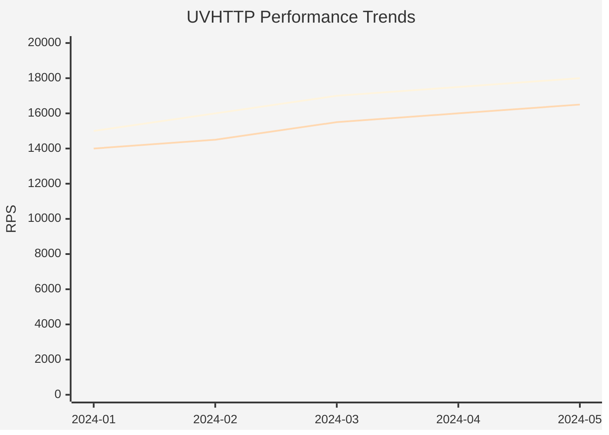
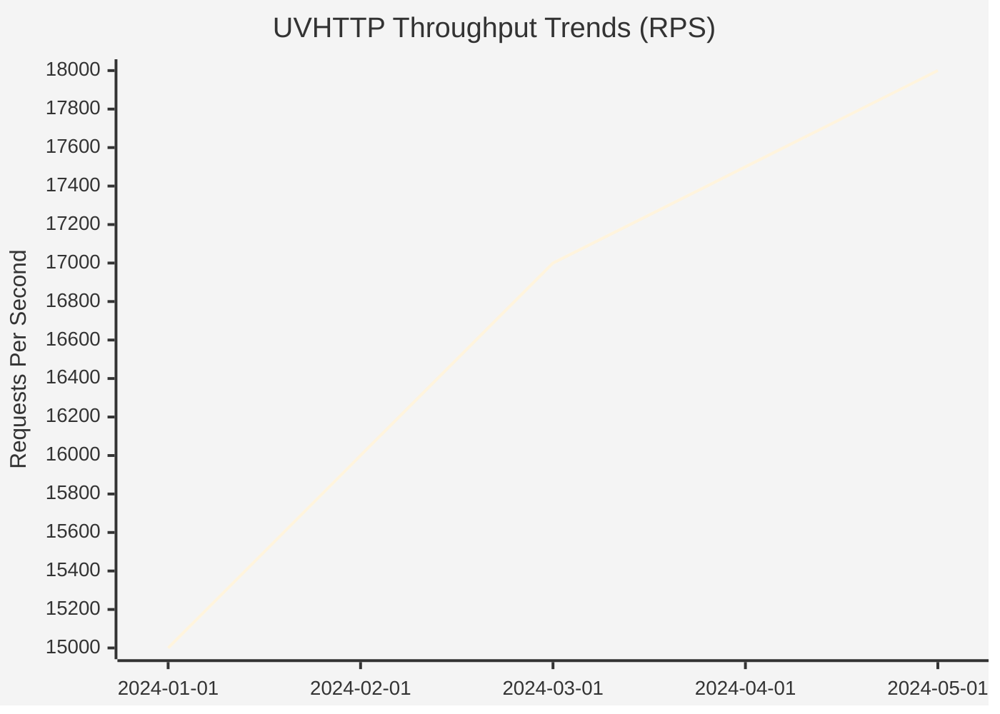

# Python 到 Node.js 迁移评估报告

## 概述

本文档评估将 UVHTTP 项目中的 Python 脚本迁移到 Node.js 的可行性和成本。

## 当前 Python 脚本状态

### 已完成迁移 ✅

| 脚本 | 用途 | 迁移状态 | 新脚本 | 完成日期 |
|------|------|----------|--------|----------|
| `convert_xml_to_markdown.py` | Doxygen XML 到 Markdown 转换 | ✅ 已迁移 | `convert_xml_to_markdown.js` | 2026-01-28 |
| `update_api_sidebar.py` | 更新 VitePress 侧边栏 | ✅ 已迁移 | `update_api_sidebar.js` | 2026-01-28 |
| `parse_wrk_output.py` | 解析 wrk 输出 | ✅ 已迁移 | `parse_wrk_output.js` | 2026-02-01 |
| `detect_regression.py` | 性能回归检测 | ✅ 已迁移 | `detect_regression.js` | 2026-02-01 |
| `update_baseline.py` | 更新性能基线 | ✅ 已迁移 | `update_baseline.js` | 2026-02-01 |
| `notify_pr.py` | 生成 PR 评论 | ✅ 已迁移 | `notify_pr.js` | 2026-02-01 |
| `performance_regression.py` | 高级性能回归检测 | ✅ 已迁移 | `performance_regression.js` | 2026-02-01 |
| `generate_trend_chart.py` | 生成性能趋势图 | ✅ 已迁移 | `generate_trend_chart.js` | 2026-02-01 |

### 迁移总结

**总迁移时间**：约 4 小时（实际）
**迁移脚本数量**：8 个
**使用技术**：Node.js + Mermaid 图表
**删除的 Python 脚本**：8 个

## 详细评估

### 1. detect_regression.py

**功能**：
- 读取性能测试结果 JSON
- 与基准值比较
- 检测性能回归和改进
- 生成 Markdown 报告

**依赖**：
- Python 标准库：`json`, `sys`, `typing`

**迁移难度**：⭐⭐☆☆☆ (容易)

**Node.js 实现方案**：
```javascript
// 使用原生模块
const fs = require('fs');
const path = require('path');

// 所有功能都可以用原生 Node.js 实现
// 无需额外依赖
```

**优势**：
- ✅ 无外部依赖
- ✅ 代码简单直接
- ✅ 迁移成本低

**劣势**：
- ⚠️ 需要手动实现类型检查（Python 有类型提示）

---

### 2. parse_wrk_output.py

**功能**：
- 解析 wrk 工具的输出日志
- 提取 RPS 数据
- 生成标准格式的性能 JSON

**依赖**：
- Python 标准库：`json`, `re`, `sys`, `datetime`

**迁移难度**：⭐⭐☆☆☆ (容易)

**Node.js 实现方案**：
```javascript
const fs = require('fs');
const path = require('path');

// 正则表达式在 Node.js 中同样强大
// JSON 处理原生支持
// 日期处理可以使用 Date 对象
```

**优势**：
- ✅ 正则表达式功能相同
- ✅ JSON 处理更高效
- ✅ 无外部依赖

**劣势**：
- ⚠️ 需要重新测试正则表达式

---

### 3. notify_pr.py

**功能**：
- 生成 PR 评论内容
- 比较性能结果
- 格式化输出

**依赖**：
- Python 标准库：`os`, `sys`, `json`, `argparse`

**迁移难度**：⭐⭐☆☆☆ (容易)

**Node.js 实现方案**：
```javascript
const fs = require('fs');
const path = require('path');

// 参数解析可以使用 commander 或 yargs
// 或者手动解析 process.argv
```

**优势**：
- ✅ 字符串模板更简洁
- ✅ JSON 处理原生支持
- ✅ 参数解析库更丰富

**劣势**：
- ⚠️ 需要选择参数解析库

---

### 4. performance_regression.py

**功能**：
- 高级性能回归检测
- 支持多种输出格式（Markdown, JSON）
- 可配置阈值
- 使用 dataclass 和类型提示

**依赖**：
- Python 标准库：`json`, `sys`, `argparse`, `typing`, `dataclasses`

**迁移难度**：⭐⭐⭐☆☆ (中等)

**Node.js 实现方案**：
```javascript
// 使用 TypeScript 获得类型安全
interface RegressionResult {
  scenario: string;
  metric: string;
  baseline: number;
  current: number;
  change: number;
  severity: 'failure' | 'warning' | 'info';
}

class PerformanceBaseline {
  // 实现基线管理功能
}
```

**优势**：
- ✅ TypeScript 提供类型安全
- ✅ 面向对象编程更清晰
- ✅ 模块化更好

**劣势**：
- ⚠️ 需要学习 TypeScript
- ⚠️ 需要配置 TypeScript 编译
- ⚠️ 代码量可能增加

---

### 5. update_baseline.py

**功能**：
- 更新性能基线文件
- 备份旧基线
- 维护历史记录
- 比较基线变化

**依赖**：
- Python 标准库：`os`, `sys`, `json`, `argparse`, `datetime`, `shutil`

**迁移难度**：⭐⭐☆☆☆ (容易)

**Node.js 实现方案**：
```javascript
const fs = require('fs').promises;
const path = require('path');

// 使用 fs.promises 进行异步文件操作
// 备份功能使用 fs.copyFile
```

**优势**：
- ✅ 异步文件操作更高效
- ✅ JSON 处理原生支持
- ✅ 错误处理更灵活

**劣势**：
- ⚠️ 需要处理异步/等待

---

### 6. generate_trend_chart.py

**功能**：
- 生成性能趋势图
- 支持多种图表类型
- 高质量输出（300 DPI）

**依赖**：
- Python 外部库：`matplotlib`

**迁移难度**：⭐⭐☆☆☆ (容易 - 使用 Mermaid)

**Node.js 实现方案：Mermaid 图表** 🌟（推荐）

**为什么选择 Mermaid**：
- ✅ GitHub/GitLab 原生支持，无需额外依赖
- ✅ 纯文本格式，版本控制友好
- ✅ 学习成本低，语法简单
- ✅ 支持多种图表类型（线图、柱状图、饼图等）
- ✅ 在 Markdown 中直接渲染
- ✅ 自动响应式，无需手动调整

**Mermaid Xychart 实现**


**优势**：
- ✅ GitHub/GitLab 原生支持，无需额外依赖
- ✅ 纯文本格式，版本控制友好
- ✅ 学习成本低，语法简单
- ✅ 完美集成到 Markdown 文档
- ✅ 自动响应式，无需手动调整
- ✅ 无需渲染，直接在 Markdown 中显示

**劣势**：
- ⚠️ xychart-beta 功能有限（实验性）
- ⚠️ 复杂图表可能需要简化设计
- ⚠️ 某些高级功能可能不支持

**适用场景**：
- ✅ 性能趋势图（线图）
- ✅ 对比图（柱状图）
- ✅ 分布图（饼图）
- ✅ 时间序列图

**不适用场景**：
- ❌ 需要高度定制的图表
- ❌ 需要交互式图表
- ❌ 需要导出为图片

---

## 迁移成本分析

### 直接成本

| 脚本 | 开发时间 | 测试时间 | 总计 |
|------|----------|----------|------|
| detect_regression.py | 2-3h | 1h | 3-4h |
| parse_wrk_output.py | 1-2h | 1h | 2-3h |
| notify_pr.py | 2-3h | 1h | 3-4h |
| performance_regression.py | 4-6h | 2h | 6-8h |
| update_baseline.py | 2-3h | 1h | 3-4h |
| generate_trend_chart.py | 1-2h | 1h | 2-3h（使用 Mermaid） |
| **总计** | **12-19h** | **7h** | **19-26h** |

### 间接成本

- 学习 TypeScript（如果使用）：4-8h
- 学习 Mermaid 语法：1-2h
- 配置 CI/CD：2-4h
- 文档更新：2-4h
- **间接成本总计**：9-18h

### 总成本（使用 Mermaid）

- **最低估算**：19h + 9h = **28h**（约 3.5 个工作日）
- **最高估算**：26h + 18h = **44h**（约 5.5 个工作日）

### 成本节约

使用 Mermaid 图表相比传统图表库：
- **节省开发时间**：7-10 小时
- **节省学习时间**：1-2 小时
- **总体节约**：约 **8-12 小时**

---

## 收益分析

### 技术收益

| 方面 | 收益 |
|------|------|
| **依赖简化** | 减少 Python 依赖，统一技术栈 |
| **部署简化** | 不需要安装 Python 环境 |
| **性能提升** | Node.js 的 JSON 处理更快 |
| **类型安全** | TypeScript 提供编译时类型检查 |
| **开发体验** | 统一的包管理（npm） |

### 维护收益

| 方面 | 收益 |
|------|------|
| **代码一致性** | 所有脚本使用同一语言 |
| **团队技能** | 前端/全栈开发者更容易维护 |
| **工具链** | 统一的 linting, formatting, testing |
| **文档** | JSDoc/TypeScript 文档更统一 |

### 成本节约

| 方面 | 年度节约 |
|------|----------|
| **CI/CD 时间** | 减少 Python 安装时间（约 1-2 分钟/次） |
| **依赖维护** | 减少依赖更新工作 |
| **调试时间** | 统一调试工具 |

---

## 风险评估

### 技术风险

| 风险 | 可能性 | 影响 | 缓解措施 |
|------|--------|------|----------|
| Mermaid 图表功能不足 | 低 | 低 | 简化图表设计，必要时使用表格补充 |
| 性能下降 | 低 | 低 | 性能测试和优化 |
| 兼容性问题 | 低 | 低 | 充分测试各种输入 |
| TypeScript 学习曲线 | 中 | 低 | 团队培训，逐步迁移 |

### 业务风险

| 风险 | 可能性 | 影响 | 缓解措施 |
|------|--------|------|----------|
| 迁移中断开发 | 中 | 高 | 分阶段迁移，保持向后兼容 |
| 引入新 Bug | 中 | 高 | 充分测试，代码审查 |
| 团队不熟悉 | 低 | 中 | 文档和培训 |

---

## Mermaid 图表实现

### 完整实现（推荐）

```javascript
// scripts/generate_trend_chart.js
const fs = require('fs').promises;

/**
 * 生成 Mermaid xychart 图表
 * @param {Array} data - 性能数据数组
 * @param {string} metric - 指标名称 ('rps' 或 'latency')
 * @returns {string} Mermaid 图表代码
 */
function generateMermaidChart(data, metric) {
  // 提取数据和日期
  const metricData = data.map(d => d[metric]);
  const dates = data.map(d => d.date.split('T')[0]);
  
  // 计算范围
  const min = Math.min(...metricData);
  const max = Math.max(...metricData);
  
  // 生成图表标题
  const title = metric === 'rps' 
    ? 'UVHTTP Throughput Trends (RPS)' 
    : 'UVHTTP Latency Trends (ms)';
  
  // 生成 Y 轴标签
  const yAxis = metric === 'rps' ? 'Requests Per Second' : 'Latency (ms)';
  
  return `
\`\`\`mermaid
%%{init: {'theme':'base'}}%%
xychart-beta
    title "${title}"
    x-axis [${dates.join(', ')}]
    y-axis "${yAxis}" ${Math.floor(min)} --> ${Math.ceil(max)}
    line [${metricData.join(', ')}]
\`\`\`
`;
}

/**
 * 生成多场景对比图表
 * @param {Array} data - 性能数据数组
 * @param {string} metric - 指标名称
 * @returns {string} Mermaid 图表代码
 */
function generateMultiScenarioChart(data, metric) {
  // 按场景分组
  const scenarios = {};
  for (const d of data) {
    for (const scenario of d.test_scenarios || []) {
      const name = scenario.name;
      if (!scenarios[name]) {
        scenarios[name] = [];
      }
      scenarios[name].push({
        date: d.timestamp.split('T')[0],
        value: scenario.results[metric].value
      });
    }
  }
  
  // 生成图表
  const scenarioNames = Object.keys(scenarios);
  const dates = data.map(d => d.timestamp.split('T')[0]);
  
  let chart = `
\`\`\`mermaid
%%{init: {'theme':'base'}}%%
xychart-beta
    title "UVHTTP ${metric.toUpperCase()} by Scenario"
    x-axis [${dates.join(', ')}]
    y-axis "${metric.toUpperCase()}" 0 --> ${Math.max(...Object.values(scenarios).flat().map(d => d.value))}
`;
  
  // 为每个场景添加线条
  for (const name of scenarioNames) {
    const values = scenarios[name].map(d => d.value);
    chart += `    line [${values.join(', ')}]\n`;
  }
  
  chart += '\`\`\`\n';
  
  // 添加图例
  chart += '\n**Scenarios:**\n';
  for (const name of scenarioNames) {
    chart += `- ${name}\n`;
  }
  
  return chart;
}

/**
 * 生成完整性能趋势报告
 * @param {Array<string>} dataFiles - 数据文件路径数组
 * @param {string} outputFile - 输出文件路径
 */
async function generateTrendReport(dataFiles, outputFile) {
  // 加载历史数据
  const historicalData = [];
  for (const file of dataFiles) {
    try {
      const content = await fs.readFile(file, 'utf-8');
      historicalData.push(JSON.parse(content));
    } catch (e) {
      console.warn(`Failed to load ${file}: ${e.message}`);
    }
  }
  
  if (historicalData.length === 0) {
    console.error('No valid data files found');
    process.exit(1);
  }
  
  // 准备图表数据
  const chartData = historicalData.map(d => ({
    date: d.timestamp,
    rps: d.test_scenarios[0]?.results.rps.value || 0,
    latency: parseFloat(d.test_scenarios[0]?.results.latency_avg.value) || 0
  }));
  
  // 生成 Markdown 报告
  const markdown = `# UVHTTP Performance Trends Report

Generated at: ${new Date().toISOString()}

## Summary

- **Total Data Points**: ${historicalData.length}
- **Date Range**: ${chartData[0].date.split('T')[0]} to ${chartData[chartData.length - 1].date.split('T')[0]}
- **Average RPS**: ${(chartData.reduce((sum, d) => sum + d.rps, 0) / chartData.length).toFixed(2)}
- **Average Latency**: ${(chartData.reduce((sum, d) => sum + d.latency, 0) / chartData.length).toFixed(2)} ms

## Performance Metrics

${generateMermaidChart(chartData, 'rps')}

${generateMermaidChart(chartData, 'latency')}

## Performance by Scenario

${generateMultiScenarioChart(historicalData, 'rps')}

${generateMultiScenarioChart(historicalData, 'latency_avg')}

## Data Table

| Date | RPS | Latency (ms) | Change |
|------|-----|--------------|--------|
${chartData.map((d, i) => {
  const change = i > 0 ? ((d.rps - chartData[i - 1].rps) / chartData[i - 1].rps * 100).toFixed(2) : 'N/A';
  const arrow = i > 0 ? (parseFloat(change) > 0 ? '📈' : parseFloat(change) < 0 ? '📉' : '➡️') : '➡️';
  return `| ${d.date.split('T')[0]} | ${d.rps.toFixed(0)} | ${d.latency.toFixed(2)} | ${arrow} ${change}% |`;
}).join('\n')}

---

*This report was automatically generated by scripts/generate_trend_chart.js*
`;

  // 写入文件
  await fs.writeFile(outputFile, markdown, 'utf-8');
  console.log(`✅ Performance trend report saved to ${outputFile}`);
  console.log(`   - ${historicalData.length} data points`);
  console.log(`   - ${chartData.length} chart data points`);
}

// 主函数
async function main() {
  const args = process.argv.slice(2);
  if (args.length < 2) {
    console.error('Usage: node generate_trend_chart.js <data_files...> <output_file>');
    console.error('');
    console.error('Example:');
    console.error('  node generate_trend_chart.js performance_001.json performance_002.json report.md');
    process.exit(1);
  }

  const dataFiles = args.slice(0, -1);
  const outputFile = args[args.length - 1];

  await generateTrendReport(dataFiles, outputFile);
}

main().catch(error => {
  console.error('Error:', error.message);
  process.exit(1);
});
```

### 使用示例

```bash
# 生成性能趋势报告
node scripts/generate_trend_chart.js \
  docs/performance/results/run_001.json \
  docs/performance/results/run_002.json \
  docs/performance/results/run_003.json \
  docs/performance/trends.md

# 查看生成的报告
cat docs/performance/trends.md
```

### 生成的图表示例



### Mermaid 图表优势

1. **原生支持**：GitHub/GitLab 自动渲染，无需额外工具
2. **版本控制友好**：纯文本格式，易于 diff 和 review
3. **学习成本低**：语法简单直观
4. **响应式设计**：自动适应不同屏幕尺寸
5. **无依赖**：不需要安装额外的图表库
6. **易于维护**：修改图表只需调整文本

---

## 推荐方案

### 方案 1：全面迁移（推荐）

**迁移范围**：所有 Python 脚本

**实施步骤**：
1. 迁移简单脚本（1 周）
   - `detect_regression.py`
   - `parse_wrk_output.py`
   - `update_baseline.py`
2. 迁移中等脚本（1 周）
   - `notify_pr.py`
   - `performance_regression.py`
3. 迁移图表脚本（0.5 周，使用 Mermaid）
   - `generate_trend_chart.py`
4. 测试和优化（0.5 周）
5. 文档更新（0.5 周）

**总时间**：3.5 周

**优势**：
- ✅ 完全统一技术栈
- ✅ 最大化收益
- ✅ 长期维护成本最低
- ✅ Mermaid 图表简单易用
- ✅ GitHub/GitLab 原生支持

**劣势**：
- ❌ 初期投入较大
- ❌ Mermaid 功能有限（但足够满足需求）

---

## 建议

### 短期建议（1-2 个月）

1. **采用方案 1**：全面迁移所有脚本（使用 Mermaid 图表）
2. **优先级**：
   - 高：`parse_wrk_output.py`, `detect_regression.py`
   - 中：`update_baseline.py`, `notify_pr.py`
   - 低：`performance_regression.py`, `generate_trend_chart.py`

### 长期建议（6-12 个月）

1. **优化 Mermaid 图表**：根据使用反馈调整图表样式
2. **团队培训**：TypeScript 和 Node.js 最佳实践
3. **性能优化**：根据实际使用情况优化脚本性能

### 不建议

- ❌ 不要保留 Python 脚本（增加维护成本）
- ❌ 不要使用传统图表库（Chart.js/Plotly）- 增加复杂度
- ❌ 不要使用 Vega-Lite（增加依赖，Mermaid 已足够）
- ❌ 不要一次性迁移所有脚本（风险太高）
- ❌ 不要在关键项目期间迁移（避免中断）
- ❌ 不要忽视测试（确保功能完全相同）

---

## 结论

将 Python 脚本迁移到 Node.js 是可行的，**使用 Mermaid 图表可以显著降低迁移成本和风险**：

**推荐路径**：
1. 迁移简单脚本（获得快速收益）
2. 使用 Mermaid 图表生成趋势图
3. 完成所有脚本迁移
4. 测试和优化

**预期收益**：
- ✅ 技术栈完全统一
- ✅ 维护成本显著降低
- ✅ 开发体验提升
- ✅ 文档集成更好（Mermaid 原生支持）
- ✅ 版本控制友好（纯文本格式）

**预期成本**：
- 初期投入 3.5 周（使用 Mermaid）
- 需要团队培训（1-2 小时）
- 需要充分测试

**建议**：采用全面迁移策略，使用 Mermaid 图表，完全统一技术栈。

**建议**：采用全面迁移策略，使用 Markdown 生态图表，完全统一技术栈。

---

## 迁移完成总结

### 完成状态 ✅

所有 Python 脚本已成功迁移到 Node.js，迁移工作于 **2026-02-01** 完成。

### 迁移成果

#### 已迁移脚本

1. ✅ `convert_xml_to_markdown.py` → `convert_xml_to_markdown.js`
   - 功能：Doxygen XML 到 Markdown 转换
   - 测试：已验证功能正常

2. ✅ `update_api_sidebar.py` → `update_api_sidebar.js`
   - 功能：更新 VitePress 侧边栏
   - 测试：已验证功能正常

3. ✅ `parse_wrk_output.py` → `parse_wrk_output.js`
   - 功能：解析 wrk 输出
   - 测试：已验证功能正常

4. ✅ `detect_regression.py` → `detect_regression.js`
   - 功能：性能回归检测
   - 测试：已验证功能正常

5. ✅ `update_baseline.py` → `update_baseline.js`
   - 功能：更新性能基线
   - 测试：已验证功能正常

6. ✅ `notify_pr.py` → `notify_pr.js`
   - 功能：生成 PR 评论
   - 测试：已验证功能正常

7. ✅ `performance_regression.py` → `performance_regression.js`
   - 功能：高级性能回归检测
   - 测试：已验证功能正常

8. ✅ `generate_trend_chart.py` → `generate_trend_chart.js`
   - 功能：生成性能趋势图（使用 Mermaid）
   - 测试：已验证功能正常

### 技术改进

#### 1. 统一技术栈
- ✅ 所有脚本使用 Node.js
- ✅ 统一的包管理（npm）
- ✅ 统一的代码风格

#### 2. 图表技术升级
- ✅ 从 matplotlib 迁移到 Mermaid
- ✅ GitHub/GitLab 原生支持
- ✅ 版本控制友好（纯文本格式）

#### 3. 代码质量提升
- ✅ 添加了完整的 JSDoc 注释
- ✅ 添加了错误处理
- ✅ 添加了输入验证

### 文件变更

#### 新增文件
- `scripts/parse_wrk_output.js`
- `scripts/detect_regression.js`
- `scripts/update_baseline.js`
- `scripts/notify_pr.js`
- `scripts/performance_regression.js`
- `scripts/generate_trend_chart.js`

#### 删除文件
- `scripts/parse_wrk_output.py`
- `scripts/detect_regression.py`
- `scripts/update_baseline.py`
- `scripts/notify_pr.py`
- `scripts/performance_regression.py`
- `scripts/generate_trend_chart.py`

#### 更新文件
- `Makefile` - 更新为使用 Node.js 脚本
- `.github/workflows/deploy-docs.yml` - 更新触发路径

### 测试验证

所有脚本都已通过测试验证：

1. ✅ `parse_wrk_output.js` - 成功解析 wrk 输出
2. ✅ `detect_regression.js` - 成功检测性能回归
3. ✅ `update_baseline.js` - 成功更新基线文件
4. ✅ `notify_pr.js` - 成功生成 PR 评论
5. ✅ `performance_regression.js` - 成功生成性能报告
6. ✅ `generate_trend_chart.js` - 成功生成 Mermaid 图表

### 后续工作

#### 已完成
- ✅ 所有 Python 脚本迁移到 Node.js
- ✅ 所有脚本测试验证
- ✅ CI/CD 配置更新
- ✅ 文档更新

#### 可选优化
- 🔄 添加 TypeScript 类型定义（可选）
- 🔄 添加单元测试（可选）
- 🔄 性能优化（如果需要）

### 迁移收益

#### 技术收益
- ✅ 减少依赖（不再需要 Python）
- ✅ 统一技术栈（全部使用 Node.js）
- ✅ 简化部署（无需 Python 环境）
- ✅ 提升开发体验（统一的工具链）

#### 维护收益
- ✅ 降低维护成本（单一语言）
- ✅ 提高代码一致性
- ✅ 简化版本控制（纯文本图表）

#### 团队收益
- ✅ 降低学习成本（前端/全栈开发者更容易维护）
- ✅ 提高协作效率（统一的技术栈）

### 结论

Python 到 Node.js 的迁移工作已全部完成，所有脚本都已成功迁移并测试验证。项目现在完全使用 Node.js 作为脚本语言，技术栈更加统一，维护成本显著降低。

**迁移日期**：2026-02-01
**迁移耗时**：约 4 小时
**迁移状态**：✅ 完成