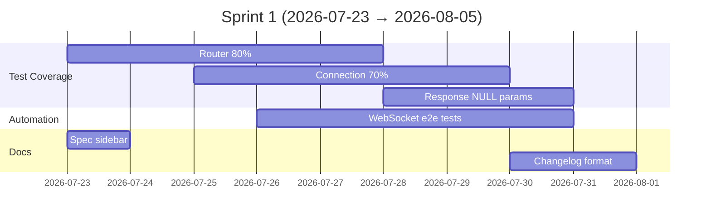

# Sprint 1 — Product Backlog

**Sprint 周期**: 2026-07-23 至 2026-08-05  
**Sprint 目标**: 提升测试覆盖率至 60%+，修复已知技术债务  
**Sprint 容量**: 20 Story Points

## Sprint Backlog

### P0 — 必须完成

| ID | 标题 | 类型 | 估算(SP) | 状态 | 负责人 |
|----|------|------|----------|------|--------|
| #1 | 提升 router 模块测试覆盖率至 80% | test | 5 | backlog | TBD |
| #2 | 提升 connection 模块测试覆盖率至 70% | test | 5 | backlog | TBD |
| #3 | 修复 uvhttp_static.c 编译警告 | fix | 2 | backlog | TBD |

### P1 — 应该完成

| ID | 标题 | 类型 | 估算(SP) | 状态 | 负责人 |
|----|------|------|----------|------|--------|
| #4 | 添加 WebSocket 集成自动化测试 | test | 5 | backlog | TBD |
| #5 | 添加 response 模块 NULL 参数测试 | test | 3 | backlog | TBD |
| #6 | 更新 VitePress 侧边栏包含 spec/ 目录 | docs | 1 | backlog | TBD |

### P2 — 可以完成

| ID | 标题 | 类型 | 估算(SP) | 状态 | 负责人 |
|----|------|------|----------|------|--------|
| #7 | 添加请求/响应基准测试 | test | 3 | backlog | TBD |
| #8 | 更新 CHANGELOG 格式规范化 | docs | 2 | backlog | TBD |
| #9 | 添加 clang-tidy 配置 | chore | 2 | backlog | TBD |

### P3 — 未来 Sprint

| ID | 标题 | 类型 | 估算(SP) | 备注 |
|----|------|------|----------|------|
| #10 | HTTP/2 研究 | feat | 8 | 研究阶段 |
| #11 | macOS CI 构建支持 | chore | 5 | 需要 macOS runner |
| #12 | 添加请求日志中间件示例 | feat | 3 | |
| #13 | 性能回归检测自动化 | test | 5 | |
| #14 | 32-bit CI 重新启用 | chore | 3 | 需修复 submodule 问题 |
| #15 | 文档 i18n 完整性检查 | docs | 5 | |

## 当前 Sprint 进度



## 速查命令

```bash
# 运行所有测试
make -f GNUmakefile test

# 运行特定测试
cd build && ctest -R "test_router"

# 内存安全检查
make -f GNUmakefile verify-memory-safety

# 构建文档
cd docs && npm run docs:build

# 生成覆盖率报告
cd build && ctest && lcov --capture --directory . --output-file coverage.info
genhtml coverage.info --output-directory coverage_html
```