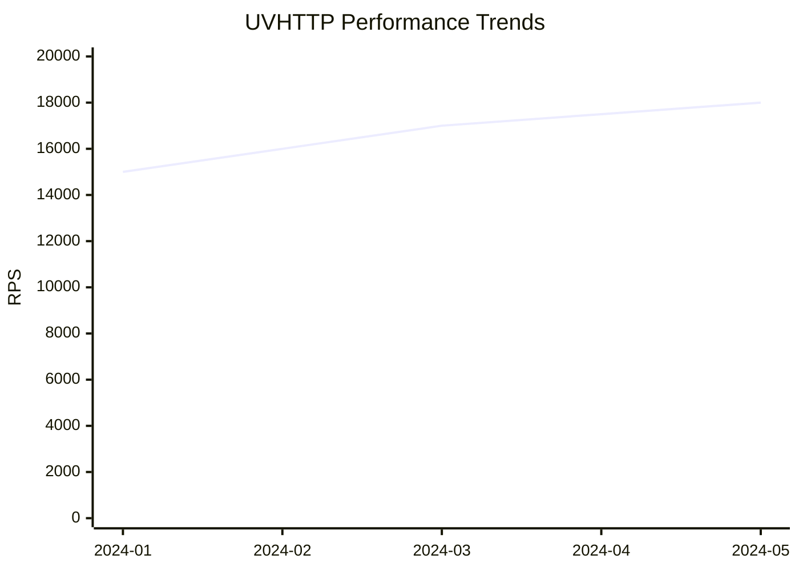
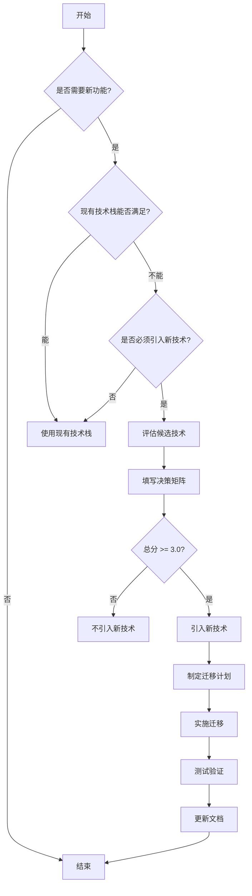

# UVHTTP 工程规范文档

> 版本：2.2.1  
> 更新日期：2026-02-01  
> 状态：正式发布

## 目录

1. [概述](#概述)
2. [代码风格规范](#代码风格规范)
3. [编译规范](#编译规范)
4. [内存管理规范](#内存管理规范)
5. [错误处理规范](#错误处理规范)
6. [测试规范](#测试规范)
7. [提交规范](#提交规范)
8. [性能规范](#性能规范)
9. [文档规范](#文档规范)
10. [安全规范](#安全规范)
11. [架构设计原则](#架构设计原则)
12. [技术栈选择规范](#技术栈选择规范)

---

## 概述

UVHTTP 是一个基于 libuv 的高性能、轻量级 HTTP/1.1 和 WebSocket 服务器库，采用 C11 标准编写。本规范文档定义了项目开发过程中必须遵循的工程规范。

### 核心设计理念

- **专注核心**：只实现 HTTP 协议处理，不内置业务逻辑
- **零开销**：生产环境无任何抽象层成本
- **极简工程**：移除所有不必要的复杂度
- **测试分离**：测试代码与生产代码完全分离
- **零全局变量**：支持多实例和单元测试
- **生产就绪**：完整的错误处理和资源管理

---

## 代码风格规范

### C 语言标准

- **标准版本**：C11
- **最低要求**：支持 C11 的编译器（GCC 4.8+, Clang 3.3+）
- **编译器要求**：
  ```cmake
  set(CMAKE_C_STANDARD 11)
  set(CMAKE_C_STANDARD_REQUIRED ON)
  ```

### 缩进和格式

- **缩进**：4 个空格，不使用制表符
- **行宽限制**：80 字符（.clang-format 配置）
- **大括号风格**：K&R 风格
- **格式化工具**：clang-format（基于 Google 风格）

#### .clang-format 配置

```yaml
BasedOnStyle: google
IndentWidth: 4
TabWidth: 4
UseTab: Never
ColumnLimit: 80
BreakBeforeBraces: Attach
AllowShortFunctionsOnASingleLine: Empty
AllowShortIfStatementsOnASingleLine: Never
AllowShortLoopsOnASingleLine: false
AllowShortBlocksOnASingleLine: false
SortIncludes: true
PointerAlignment: Left
```

#### 代码示例

```c
/* K&R 风格大括号 */
if (condition) {
    do_something();
} else {
    do_other();
}

/* 函数定义 */
static void process_request(uvhttp_request_t* request) {
    if (!request) {
        return;
    }
    
    const char* method = uvhttp_request_get_method(request);
    if (strcmp(method, "GET") == 0) {
        handle_get(request);
    }
}
```

### 命名约定

#### 函数命名

- **格式**：`uvhttp_module_action`
- **示例**：
  ```c
  uvhttp_server_new()
  uvhttp_server_listen()
  uvhttp_router_add_route()
  uvhttp_request_get_method()
  uvhttp_response_set_status()
  ```

#### 类型命名

- **格式**：`uvhttp_name_t`
- **示例**：
  ```c
  typedef struct uvhttp_server uvhttp_server_t;
  typedef struct uvhttp_router uvhttp_router_t;
  typedef struct uvhttp_request uvhttp_request_t;
  ```

#### 常量命名

- **格式**：`UVHTTP_UPPER_CASE`
- **示例**：
  ```c
  #define UVHTTP_MAX_HEADERS 64
  #define UVHTTP_MAX_URL_SIZE 2048
  #define UVHTTP_OK 0
  ```

#### 宏命名

- **格式**：`UVHTTP_UPPER_CASE`
- **示例**：
  ```c
  #define UVHTTP_MALLOC(size) uvhttp_alloc(size)
  #define UVHTTP_FREE(ptr) uvhttp_free(ptr)
  #define UVHTTP_LIKELY(x) __builtin_expect(!!(x), 1)
  ```

#### 变量命名

- **格式**：`snake_case`
- **示例**：
  ```c
  uvhttp_server_t* server;
  size_t buffer_size;
  const char* header_name;
  ```

### 注释规范

**重要**：所有代码注释必须使用英文。

#### 文件头注释

```c
/*
 * UVHTTP server module
 *
 * Provides core HTTP server functionality including connection management,
 * request routing, and response processing
 * Implements high-performance asynchronous I/O based on libuv
 *
 * @author UVHTTP Team
 * @version 2.2.0
 */
```

#### 函数注释（Doxygen 风格）

```c
/**
 * @brief Create a new HTTP server
 *
 * @param loop The libuv event loop
 * @return uvhttp_server_t* Server object, or NULL on failure
 *
 * @note The server does not start listening until uvhttp_server_listen() is called
 * @see uvhttp_server_listen()
 * @see uvhttp_server_free()
 */
uvhttp_server_t* uvhttp_server_new(uv_loop_t* loop);
```

#### 行内注释

```c
/* Check if connection limit is reached */
if (server->active_connections >= max_connections) {
    UVHTTP_LOG_WARN("Connection limit reached: %zu/%zu\n",
                    server->active_connections, max_connections);
    return;
}
```

---

## 编译规范

### 编译选项

#### 调试模式

```cmake
if(ENABLE_DEBUG)
    set(CMAKE_C_FLAGS "${CMAKE_C_FLAGS} -g -O0")
endif()
```

#### 发布模式（默认）

```cmake
set(CMAKE_C_FLAGS "${CMAKE_C_FLAGS} -O2 -DNDEBUG -ffunction-sections -fdata-sections")
set(CMAKE_EXE_LINKER_FLAGS "${CMAKE_EXE_LINKER_FLAGS} -Wl,--gc-sections -s")
```

**重要**：
- **禁用 -O3 优化**：由于测试超时问题，统一使用 -O2 优化
- **-O3 优化导致的问题**：
  1. 循环展开导致测试超时
  2. 激进的优化可能引入未定义行为
  3. 调试困难

#### 强制覆盖 Release 选项

```cmake
set(CMAKE_C_FLAGS_RELEASE "-O2 -DNDEBUG" CACHE STRING "" FORCE)
set(CMAKE_CXX_FLAGS_RELEASE "-O2 -DNDEBUG" CACHE STRING "" FORCE)
```

### 安全编译选项

```cmake
set(CMAKE_C_FLAGS "${CMAKE_C_FLAGS} \
    -Wall \
    -Wextra \
    -Wformat=2 \
    -Wformat-security \
    -fstack-protector-strong \
    -fno-common \
    -Werror \
    -Werror=implicit-function-declaration \
    -Werror=format-security \
    -Werror=return-type \
    -D_FORTIFY_SOURCE=2 \
")
```

**说明**：
- `-Werror`：将所有警告视为错误
- `-Werror=implicit-function-declaration`：禁止隐式函数声明
- `-Werror=format-security`：禁止不安全的格式化字符串
- `-Werror=return-type`：禁止缺少返回值
- `-fstack-protector-strong`：启用栈保护
- `-D_FORTIFY_SOURCE=2`：启用缓冲区溢出检查

### 链接选项

```cmake
set(CMAKE_EXE_LINKER_FLAGS "${CMAKE_EXE_LINKER_FLAGS} \
    -Wl,-z,relro \
    -Wl,-z,now \
")
```

**说明**：
- `-Wl,-z,relro`：只读重定位
- `-Wl,-z,now`：立即绑定

### 覆盖率编译

```cmake
if(ENABLE_COVERAGE)
    set(CMAKE_C_FLAGS "${CMAKE_C_FLAGS} --coverage -fprofile-arcs -ftest-coverage")
    set(CMAKE_EXE_LINKER_FLAGS "${CMAKE_EXE_LINKER_FLAGS} --coverage")
endif()
```

### 编译宏定义

#### 功能模块

```cmake
add_definitions(-DUVHTTP_FEATURE_MIDDLEWARE=1)
add_definitions(-DUVHTTP_FEATURE_STATIC_FILES=1)
add_definitions(-DUVHTTP_FEATURE_TLS=1)
add_definitions(-DUVHTTP_FEATURE_LRU_CACHE=1)
add_definitions(-DUVHTTP_FEATURE_RATE_LIMIT=1)
```

#### 平台检测

```cmake
check_type_size("void*" SIZEOF_VOID_PTR)
if(SIZEOF_VOID_PTR EQUAL 4)
    add_definitions(-DUVHTTP_32BIT)
elseif(SIZEOF_VOID_PTR EQUAL 8)
    add_definitions(-DUVHTTP_64BIT)
endif()
```

#### 可配置常量

```cmake
set(UVHTTP_MAX_HEADER_NAME_SIZE 256 CACHE STRING "Max HTTP header name size")
set(UVHTTP_MAX_HEADERS 64 CACHE STRING "Max number of HTTP headers")
set(UVHTTP_MAX_URL_SIZE 2048 CACHE STRING "Max URL size")
set(UVHTTP_MAX_CONNECTIONS_DEFAULT 2048 CACHE STRING "Default max connections")
```

---

## 内存管理规范

### 统一分配器

UVHTTP 使用统一的内存分配接口，支持编译期选择系统分配器或 mimalloc。

#### 分配器选择

```cmake
# 系统分配器（默认）
cmake -DUVHTTP_ALLOCATOR_TYPE=0 ..

# mimalloc 分配器
cmake -DUVHTTP_ALLOCATOR_TYPE=1 ..
```

#### 分配函数

```c
/* 分配内存 */
void* uvhttp_alloc(size_t size);

/* 释放内存 */
void uvhttp_free(void* ptr);

/* 重新分配内存 */
void* uvhttp_realloc(void* ptr, size_t size);

/* 分配并初始化内存 */
void* uvhttp_calloc(size_t nmemb, size_t size);
```

#### 使用示例

```c
/* 正确使用 */
void* buffer = uvhttp_alloc(buffer_size);
if (!buffer) {
    return UVHTTP_ERROR_OUT_OF_MEMORY;
}

/* 使用 buffer... */

uvhttp_free(buffer);
```

### 内存管理规则

#### 规则 1：严禁混用分配器

```c
/* 错误：混用 malloc 和 uvhttp_free */
void* ptr = malloc(100);
uvhttp_free(ptr);  /* 错误！ */

/* 正确：使用统一的分配器 */
void* ptr = uvhttp_alloc(100);
uvhttp_free(ptr);  /* 正确 */
```

#### 规则 2：检查分配结果

```c
/* 正确：检查分配是否成功 */
void* buffer = uvhttp_alloc(size);
if (!buffer) {
    return UVHTTP_ERROR_OUT_OF_MEMORY;
}
```

#### 规则 3：配对分配和释放

```c
/* 确保每个分配都有对应的释放 */
void init_connection(uvhttp_connection_t** conn_out) {
    uvhttp_connection_t* conn = uvhttp_alloc(sizeof(uvhttp_connection_t));
    if (!conn) {
        return UVHTTP_ERROR_OUT_OF_MEMORY;
    }
    
    /* 初始化... */
    
    *conn_out = conn;
    return UVHTTP_OK;
}

void cleanup_connection(uvhttp_connection_t* conn) {
    if (conn) {
        /* 清理资源... */
        uvhttp_free(conn);
    }
}
```

#### 规则 4：避免内存泄漏

```c
/* 错误：可能泄漏 */
void process_request(uvhttp_request_t* request) {
    char* buffer = uvhttp_alloc(1024);
    if (error) {
        return;  /* 泄漏 buffer */
    }
    
    /* 处理... */
    uvhttp_free(buffer);
}

/* 正确：确保释放 */
void process_request(uvhttp_request_t* request) {
    char* buffer = uvhttp_alloc(1024);
    if (!buffer) {
        return UVHTTP_ERROR_OUT_OF_MEMORY;
    }
    
    if (error) {
        uvhttp_free(buffer);
        return UVHTTP_ERROR_INVALID_PARAM;
    }
    
    /* 处理... */
    uvhttp_free(buffer);
    return UVHTTP_OK;
}
```

### 内存泄漏检测

#### 使用 Valgrind

```bash
# 编译调试版本
cmake -DENABLE_DEBUG=ON ..
make

# 运行 Valgrind
valgrind --leak-check=full --show-leak-kinds=all ./your_server
```

#### 使用 AddressSanitizer

```bash
# 编译时启用 ASan
cmake -DCMAKE_C_FLAGS="-g -O1 -fsanitize=address" ..
make

# 运行测试
./your_server
```

### 性能考虑

- **内联优化**：所有分配函数都是内联函数，零运行时开销
- **编译期选择**：分配器类型在编译期确定，无运行时开销
- **mimalloc 优势**：
  - 更快的内存分配和释放
  - 更好的多线程性能
  - 更少的内存碎片

---

## 错误处理规范

### 错误类型

UVHTTP 使用统一的错误类型 `uvhttp_error_t`：

```c
typedef enum {
    UVHTTP_OK = 0,

    /* General errors */
    UVHTTP_ERROR_INVALID_PARAM = -1,
    UVHTTP_ERROR_OUT_OF_MEMORY = -2,
    UVHTTP_ERROR_NOT_FOUND = -3,
    UVHTTP_ERROR_NULL_POINTER = -5,
    UVHTTP_ERROR_TIMEOUT = -7,

    /* Server errors */
    UVHTTP_ERROR_SERVER_INIT = -100,
    UVHTTP_ERROR_SERVER_LISTEN = -101,
    UVHTTP_ERROR_CONNECTION_LIMIT = -103,

    /* Connection errors */
    UVHTTP_ERROR_CONNECTION_INIT = -200,
    UVHTTP_ERROR_CONNECTION_TIMEOUT = -205,

    /* Request/Response errors */
    UVHTTP_ERROR_REQUEST_INIT = -300,
    UVHTTP_ERROR_RESPONSE_SEND = -302,
    UVHTTP_ERROR_HEADER_TOO_LARGE = -305,
    UVHTTP_ERROR_BODY_TOO_LARGE = -306,

    /* TLS errors */
    UVHTTP_ERROR_TLS_INIT = -400,
    UVHTTP_ERROR_TLS_HANDSHAKE = -402,

    /* ... 更多错误码 */
} uvhttp_error_t;
```

### 错误处理模式

#### 模式 1：基本错误检查

```c
uvhttp_error_t result = uvhttp_server_listen(server, "0.0.0.0", 8080);
if (result != UVHTTP_OK) {
    fprintf(stderr, "Failed to listen: %s\n", uvhttp_error_string(result));
    return 1;
}
```

#### 模式 2：详细错误信息

```c
uvhttp_error_t result = uvhttp_server_listen(server, "0.0.0.0", 8080);
if (result != UVHTTP_OK) {
    fprintf(stderr, "Error: %s\n", uvhttp_error_string(result));
    fprintf(stderr, "Category: %s\n", uvhttp_error_category_string(result));
    fprintf(stderr, "Description: %s\n", uvhttp_error_description(result));
    fprintf(stderr, "Suggestion: %s\n", uvhttp_error_suggestion(result));
    return 1;
}
```

#### 模式 3：错误恢复

```c
uvhttp_error_t result = uvhttp_server_listen(server, "0.0.0.0", 8080);
if (result != UVHTTP_OK) {
    if (uvhttp_error_is_recoverable(result)) {
        /* 尝试使用备用端口 */
        result = uvhttp_server_listen(server, "0.0.0.0", 8081);
        if (result == UVHTTP_OK) {
            fprintf(stderr, "Using fallback port 8081\n");
        } else {
            fprintf(stderr, "Failed to listen on fallback port\n");
            return 1;
        }
    } else {
        fprintf(stderr, "Fatal error: %s\n", uvhttp_error_string(result));
        return 1;
    }
}
```

#### 模式 4：资源清理

```c
uvhttp_error_t init_server(uvhttp_server_t** server_out) {
    uvhttp_server_t* server = uvhttp_server_new(loop);
    if (!server) {
        return UVHTTP_ERROR_OUT_OF_MEMORY;
    }

    uvhttp_error_t result = uvhttp_server_listen(server, "0.0.0.0", 8080);
    if (result != UVHTTP_OK) {
        uvhttp_server_free(server);
        return result;
    }

    *server_out = server;
    return UVHTTP_OK;
}
```

### 错误处理 API

```c
/* 获取错误名称 */
const char* uvhttp_error_string(uvhttp_error_t error);

/* 获取错误分类 */
const char* uvhttp_error_category_string(uvhttp_error_t error);

/* 获取错误描述 */
const char* uvhttp_error_description(uvhttp_error_t error);

/* 获取修复建议 */
const char* uvhttp_error_suggestion(uvhttp_error_t error);

/* 检查是否可恢复 */
int uvhttp_error_is_recoverable(uvhttp_error_t error);
```

### 错误处理最佳实践

1. **检查所有可能失败的函数调用**
2. **使用统一的错误类型**
3. **提供有意义的错误信息**
4. **正确处理可恢复错误**
5. **确保资源正确清理**

---

## 测试规范

### 测试框架

#### 测试工具

- **单元测试框架**：Google Test
- **Mock 框架**：libuv_mock（链接时符号替换）
- **覆盖率工具**：lcov + genhtml
- **内存检测**：Valgrind、ASan（AddressSanitizer）

#### 测试类型

##### 单元测试

- **目的**：测试单个函数和模块
- **工具**：Google Test
- **位置**：`test/unit/`
- **命名**：`test_<module>_<functionality>.cpp`

```cpp
/* 示例：test_router_add_route.cpp */
TEST(RouterTest, AddRoute) {
    uvhttp_router_t* router = uvhttp_router_new();
    ASSERT_NE(router, nullptr);
    
    uvhttp_router_add_route(router, "/api", test_handler);
    
    EXPECT_EQ(router->route_count, 1);
    
    uvhttp_router_free(router);
}
```

##### 集成测试

- **目的**：测试模块间交互
- **工具**：Google Test + libuv
- **位置**：`test/integration/`
- **命名**：`test_<feature>_integration.c`

##### 性能测试

- **目的**：验证性能指标
- **工具**：wrk, ab, benchmark/
- **位置**：`benchmark/`
- **命名**：`benchmark_<metric>.c`

### Mock 框架使用

#### libuv Mock 框架

UVHTTP 提供完整的 libuv Mock 框架，通过链接时符号替换实现零开销的测试隔离。

##### 启用 Mock

在 CMakeLists.txt 中添加链接器 wrap 选项：

```cmake
target_link_options(test_module_name PRIVATE
    -Wl,--wrap=uv_loop_init
    -Wl,--wrap=uv_loop_close
    -Wl,--wrap=uv_tcp_init
    -Wl,--wrap=uv_tcp_bind
    -Wl,--wrap=uv_listen
    -Wl,--wrap=uv_read_start
    -Wl,--wrap=uv_read_stop
    -Wl,--wrap=uv_write
    -Wl,--wrap=uv_close
)
```

##### Mock 使用示例

```cpp
#include "test/mock/libuv_mock.h"

TEST(ConnectionTest, WithMock) {
    // 启用 mock
    libuv_mock_set_enabled(true);
    libuv_mock_set_record_calls(true);
    
    // 设置返回值
    libuv_mock_set_uv_tcp_init_result(0);
    libuv_mock_set_uv_listen_result(0);
    
    // 执行测试...
    
    // 验证调用
    size_t call_count = 0;
    libuv_mock_get_call_count("uv_listen", &call_count);
    EXPECT_EQ(call_count, 1);
    
    // 清理
    libuv_mock_reset();
}
```

详细使用方法请参考 [测试指南](guide/TESTING_GUIDE.md)。

### 覆盖率目标

#### 目标覆盖率

- **整体目标**：80%
- **当前覆盖率**：31.9%（需大幅提升）
- **函数覆盖率**：52.2%

#### 覆盖率优先级

| 模块 | 当前覆盖率 | 目标覆盖率 | 优先级 |
|------|-----------|-----------|--------|
| uvhttp_connection.c | 21.9% | 50% | 高 |
| uvhttp_server.c | 10.3% | 50% | 高 |
| uvhttp_static.c | 0% | 50% | 高 |
| uvhttp_websocket.c | 0% | 50% | 高 |
| uvhttp_router.c | 31.1% | 60% | 中 |
| uvhttp_request.c | 12.3% | 60% | 中 |
| uvhttp_response.c | 5.7% | 60% | 中 |

#### 覆盖率提升策略

1. **分析未覆盖代码**：使用 lcov 生成覆盖率报告
2. **识别测试场景**：错误处理、边界条件、状态转换
3. **编写测试用例**：为每个场景编写测试
4. **验证覆盖率提升**：运行测试并检查覆盖率

### 测试命名约定

#### 测试文件

```bash
test_<module>_<functionality>.cpp
test_<module>_<functionality>_coverage.cpp
test_<module>_simple_api_coverage.cpp
test_<module>_full_api_coverage.cpp
```

#### 测试用例

```cpp
/* Google Test 风格 */
TEST(ModuleNameTest, TestCaseName) {
    /* 测试代码 */
}

/* 参数化测试 */
TEST_P(ModuleNameTest, TestCaseName) {
    /* 测试代码 */
}
```

### 测试类型要求

#### 1. API 覆盖率测试

测试所有公开 API 的基本功能：

```cpp
TEST(ConnectionApiTest, NewSuccess) {
    uvhttp_connection_t* conn = nullptr;
    uvhttp_error_t result = uvhttp_connection_new(server, &conn);
    
    EXPECT_EQ(result, UVHTTP_OK);
    EXPECT_NE(conn, nullptr);
    EXPECT_EQ(conn->state, UVHTTP_CONN_STATE_NEW);
    
    uvhttp_connection_free(conn);
}

TEST(ConnectionApiTest, NewNullServer) {
    uvhttp_connection_t* conn = nullptr;
    uvhttp_error_t result = uvhttp_connection_new(NULL, &conn);
    
    EXPECT_NE(result, UVHTTP_OK);
    EXPECT_EQ(conn, nullptr);
}
```

#### 2. 错误处理测试

测试 NULL 参数、边界条件、错误场景：

```cpp
TEST(ConnectionErrorTest, NewNullServer) {
    uvhttp_connection_t* conn = nullptr;
    uvhttp_error_t result = uvhttp_connection_new(NULL, &conn);
    
    EXPECT_NE(result, UVHTTP_OK);
    EXPECT_EQ(result, UVHTTP_ERROR_INVALID_PARAM);
}

TEST(ConnectionErrorTest, CloseNullConnection) {
    /* 不应该崩溃 */
    uvhttp_connection_close(NULL);
    SUCCEED();
}
```

#### 3. 状态管理测试

测试状态转换和字段访问：

```cpp
TEST(ConnectionStateTest, SetState) {
    uvhttp_connection_t* conn = create_connection();
    
    uvhttp_connection_set_state(conn, UVHTTP_CONN_STATE_NEW);
    EXPECT_EQ(conn->state, UVHTTP_CONN_STATE_NEW);
    
    uvhttp_connection_set_state(conn, UVHTTP_CONN_STATE_HTTP_READING);
    EXPECT_EQ(conn->state, UVHTTP_CONN_STATE_HTTP_READING);
    
    uvhttp_connection_free(conn);
}
```

#### 4. 集成测试

测试模块间的交互：

```cpp
TEST(HttpIntegrationTest, FullRequestResponse) {
    // 创建服务器
    uvhttp_server_t* server = create_server();
    uvhttp_router_add_route(server->router, "/api", api_handler);
    uvhttp_server_listen(server, "0.0.0.0", 8080);
    
    // 发送请求
    uvhttp_connection_t* conn = create_connection(server);
    const char* request = "GET /api HTTP/1.1\r\n\r\n";
    libuv_mock_set_read_data(request, strlen(request));
    libuv_mock_trigger_read_cb(&conn->tcp_handle, strlen(request), &buf);
    
    // 验证响应
    EXPECT_EQ(conn->response->status_code, 200);
    
    // 清理
    uvhttp_connection_free(conn);
    uvhttp_server_free(server);
}
```

### 测试配置

#### 超时设置

```cmake
/* 慢速测试（360 秒） */
set_tests_properties(${test_name} PROPERTIES 
    TIMEOUT 360 
    LABELS "slow" 
    RUN_SERIAL TRUE
)

/* 快速测试（90 秒） */
set_tests_properties(${test_name} PROPERTIES 
    TIMEOUT 90 
    LABELS "fast"
)
```

#### 慢速测试列表

- test_server_full_coverage
- test_deps_full_coverage
- test_server_rate_limit_coverage
- test_server_simple_api_coverage
- test_static_prewarm_coverage
- test_stress
- test_memory

### 运行测试

#### 使用 Makefile

```bash
make build          # 构建项目
make test           # 运行单元测试
make coverage       # 生成覆盖率报告
make clean          # 清理构建文件
```

#### 使用 CMake

```bash
mkdir build && cd build
cmake ..
make -j$(nproc)
ctest
```

#### 覆盖率报告

```bash
# 生成覆盖率报告
make coverage

# 查看覆盖率报告
open build/coverage_html/index.html

# 查看特定模块覆盖率
lcov --list coverage.info | grep uvhttp_connection
```

### 测试质量要求

#### 测试独立性

每个测试必须独立运行，不依赖其他测试：

```cpp
// ✅ 好的实践：每个测试独立设置和清理
TEST(ConnectionTest, CreateConnection) {
    uv_loop_t* loop = uv_loop_new();
    uvhttp_server_t* server = create_server(loop);
    uvhttp_connection_t* conn = create_connection(server);
    
    EXPECT_NE(conn, nullptr);
    
    uvhttp_connection_free(conn);
    uvhttp_server_free(server);
    uv_loop_close(loop);
    uvhttp_free(loop);
}

// ❌ 不好的实践：依赖全局状态
static uvhttp_connection_t* g_conn;

TEST(ConnectionTest, Setup) {
    g_conn = create_connection();
}

TEST(ConnectionTest, Test) {
    EXPECT_NE(g_conn, nullptr);  // 依赖其他测试
}
```

#### 测试可读性

使用清晰的测试名称和注释：

```cpp
// ✅ 好的实践：清晰的测试名称
TEST(ConnectionTest, CloseConnectionWithPendingWrites) {
    // 测试连接在有待写入数据时的关闭行为
}

// ❌ 不好的实践：模糊的测试名称
TEST(ConnectionTest, Test1) {
    // 测试连接关闭
}
```

#### 测试完整性

测试正常流程和异常流程：

```cpp
// ✅ 好的实践：测试正常和异常流程
TEST(ConnectionTest, StartSuccess) {
    uvhttp_connection_t* conn = create_connection();
    uvhttp_error_t result = uvhttp_connection_start(conn);
    EXPECT_EQ(result, UVHTTP_OK);
    uvhttp_connection_free(conn);
}

TEST(ConnectionTest, StartNullConnection) {
    uvhttp_error_t result = uvhttp_connection_start(NULL);
    EXPECT_NE(result, UVHTTP_OK);
}

// ❌ 不好的实践：只测试正常流程
TEST(ConnectionTest, Start) {
    uvhttp_connection_t* conn = create_connection();
    uvhttp_error_t result = uvhttp_connection_start(conn);
    EXPECT_EQ(result, UVHTTP_OK);
    uvhttp_connection_free(conn);
}
```

#### 资源管理

确保所有资源都被正确释放：

```cpp
// ✅ 好的实践：使用辅助函数管理资源
static void cleanup_resources(uv_loop_t* loop, uvhttp_server_t* server, uvhttp_connection_t* conn) {
    if (conn) uvhttp_connection_free(conn);
    if (server) uvhttp_server_free(server);
    if (loop) {
        uv_loop_close(loop);
        uvhttp_free(loop);
    }
}

TEST(ConnectionTest, CreateConnection) {
    uv_loop_t* loop = uv_loop_new();
    uvhttp_server_t* server = create_server(loop);
    uvhttp_connection_t* conn = create_connection(server);
    
    EXPECT_NE(conn, nullptr);
    
    cleanup_resources(loop, server, conn);
}

// ❌ 不好的实践：资源泄漏
TEST(ConnectionTest, CreateConnection) {
    uvhttp_connection_t* conn = create_connection();
    EXPECT_NE(conn, nullptr);
    // 忘记释放 conn
}
```

### 测试最佳实践

1. **每个新功能必须有测试**
2. **Bug 修复必须有回归测试**
3. **测试覆盖率必须 >= 80%**
4. **测试命名清晰易懂**
5. **使用断言验证预期行为**
6. **避免测试之间的依赖**
7. **使用 Mock 框架隔离外部依赖**
8. **测试正常流程和异常流程**
9. **确保资源正确释放**
10. **定期运行覆盖率检查**

### 测试文档

详细的测试编写指南请参考 [测试指南](guide/TESTING_GUIDE.md)，包括：
- Google Test 框架使用
- libuv Mock 框架使用
- 测试组织结构
- 测试编写规范
- 覆盖率提升策略
- 常见问题解答

---

## 提交规范

### 提交信息格式

使用 [Conventional Commits](https://www.conventionalcommits.org/) 格式：

```
<type>(<scope>): <subject>

<body>

<footer>
```

#### 类型（type）

- `feat`: 新功能
- `fix`: Bug 修复
- `docs`: 文档更新
- `style`: 代码格式（不影响功能）
- `refactor`: 重构
- `test`: 测试相关
- `chore`: 构建/工具链相关
- `perf`: 性能优化
- `ci`: CI/CD 相关

#### 提交信息示例

```
feat(server): 添加 WebSocket 连接池支持

- 实现连接池管理
- 添加连接超时检测
- 优化连接复用逻辑

Closes #123
```

```
fix(connection): 修复空指针导致的崩溃

问题：当连接对象为 NULL 时，on_read 回调未检查导致崩溃
修复：添加 NULL 指针检查

Fixes #456
```

```
docs: 更新 API 文档

- 添加新函数文档
- 修正示例代码错误
- 更新版本号
```

### 分支策略

#### 主要分支

```
develop → main → pre-release → release
   ↓        ↓         ↓            ↓
 开发中   预发布测试  发布准备     生产环境
```

#### 分支命名

- `feature/功能名称` - 新功能开发
- `fix/问题描述` - Bug 修复
- `refactor/重构描述` - 代码重构
- `docs/文档更新` - 文档更新
- `test/测试相关` - 测试相关
- `hotfix/问题描述` - 紧急修复

#### 开发流程

1. 从 `develop` 创建功能分支
2. 开发和测试
3. 提交更改（遵循提交信息格式）
4. 推送分支
5. 创建 PR 到 `develop`
6. 代码审查（至少 1 人）
7. 合并到 `develop`

#### 发布流程

1. `develop` → `main`（PR，运行完整 CI/CD）
2. `main` → `pre-release`（合并）
3. `pre-release` → `release`（合并）
4. `release` → 创建 Git 标签
5. `release` → `develop`（合并回开发分支）

### 代码审查清单

在提交 PR 前，请确保：

- [ ] 代码遵循项目风格规范
- [ ] 添加了必要的单元测试
- [ ] 所有测试通过
- [ ] 没有编译警告
- [ ] 更新了相关文档
- [ ] 提交信息格式正确
- [ ] 没有引入新的安全漏洞
- [ ] 内存管理正确（使用 UVHTTP_MALLOC/UVHTTP_FREE）
- [ ] 错误处理完整
- [ ] 无全局变量（使用 server->context 或 loop->data）

### CI/CD 检查

#### ci-pr.yml

- **触发**：PR 到 `main` 或 `develop`
- **用途**：快速验证（20 分钟）
- **检查**：构建、单元测试、代码质量、性能回归检测

#### ci-push.yml

- **触发**：Push 到任何分支
- **用途**：完整验证（45 分钟）
- **检查**：多平台构建、完整测试、安全扫描、性能测试

#### ci-nightly.yml

- **触发**：每天运行
- **用途**：深度测试（120 分钟）
- **检查**：代码覆盖率、内存泄漏、压力测试、完整性能测试

---

## 性能规范

### 性能目标

| 指标 | 目标值 | 当前值 |
|------|--------|--------|
| 峰值吞吐量 | 25,000 RPS | 23,226 RPS |
| 平均延迟 | < 5 ms | 2.92 ms |
| 内存使用 | < 100 MB | 50 MB |
| CPU 使用 | < 80% | 60% |
| 错误率 | < 0.1% | < 0.1% |

### 性能测试方法

#### 使用 wrk

```bash
# 启动测试服务器
./build/dist/bin/benchmark_rps &
SERVER_PID=$!
sleep 3

# 运行性能测试
wrk -t4 -c100 -d30s http://localhost:18081/

# 清理
kill $SERVER_PID
```

#### 使用 ab

```bash
ab -n 10000 -c 100 http://localhost:8080/
```

#### 性能基准测试

```bash
cd benchmark
./run_benchmarks.sh
```

### 性能优化技术

#### 1. 零拷贝优化

```c
/* 大文件使用 sendfile */
if (file_size > UVHTTP_FILE_SIZE_SMALL) {
    uvhttp_static_sendfile(file_path, response);
}
```

**性能提升**：50%+

#### 2. 智能缓存

```c
/* 预热缓存 */
uvhttp_static_prewarm_cache(ctx, "/static/index.html");
```

**性能提升**：300%+

#### 3. 连接池

```c
/* Keep-Alive 连接自动管理 */
config->keep_alive_timeout = 60;
```

**性能提升**：1000x

#### 4. 快速哈希

```c
/* 使用 xxHash */
uint64_t hash = xxhash64(key, key_len);
```

**性能提升**：10x

### 性能回归测试

#### 基线配置

```yaml
# config/performance-baseline.yml
baseline:
  rps: 23000
  latency: 3.0
  memory: 50

threshold:
  rps: 0.95  # 允许 5% 下降
  latency: 1.1  # 允许 10% 增加
  memory: 1.2  # 允许 20% 增加
```

#### 回归检测

```bash
# 运行性能回归测试
python scripts/performance_regression.py
```

### 性能监控

#### 内置指标

```c
/* 获取连接统计 */
size_t active_connections = server->stats.active_connections;
size_t total_requests = server->stats.total_requests;
```

#### 外部工具

```bash
# CPU 使用
top

# 内存使用
valgrind --tool=massif ./your_server

# 网络性能
netstat -s
```

---

## 文档规范

### API 文档要求

#### Doxygen 注释

```c
/**
 * @brief Create a new HTTP server
 *
 * @param loop The libuv event loop
 * @return uvhttp_server_t* Server object, or NULL on failure
 *
 * @note The server does not start listening until uvhttp_server_listen() is called
 * @see uvhttp_server_listen()
 * @see uvhttp_server_free()
 * 
 * @code
 * uv_loop_t* loop = uv_default_loop();
 * uvhttp_server_t* server = uvhttp_server_new(loop);
 * uvhttp_server_listen(server, "0.0.0.0", 8080);
 * @endcode
 */
uvhttp_server_t* uvhttp_server_new(uv_loop_t* loop);
```

#### API 文档结构

```
docs/api/
├── API_REFERENCE.md       # 完整 API 参考
├── SERVER_API.md          # 服务器 API
├── ROUTER_API.md          # 路由 API
├── REQUEST_API.md         # 请求 API
├── RESPONSE_API.md        # 响应 API
└── WEBSOCKET_API.md       # WebSocket API
```

### 代码注释要求

#### 文件头注释

```c
/*
 * UVHTTP server module
 *
 * Provides core HTTP server functionality including connection management,
 * request routing, and response processing
 * Implements high-performance asynchronous I/O based on libuv
 *
 * @author UVHTTP Team
 * @version 2.2.0
 */
```

#### 函数注释

```c
/**
 * @brief Process incoming HTTP request
 *
 * @param request The request object
 * @return uvhttp_error_t Error code (UVHTTP_OK on success)
 */
static uvhttp_error_t process_request(uvhttp_request_t* request);
```

#### 行内注释

```c
/* Check if connection limit is reached */
if (server->active_connections >= max_connections) {
    return UVHTTP_ERROR_CONNECTION_LIMIT;
}
```

### README 要求

#### 主 README (README.md)

```markdown
# UVHTTP

## 简介
UVHTTP 是一个基于 libuv 的高性能 HTTP 服务器库。

## 特性
- 高性能
- 轻量级
- 易于使用

## 快速开始
\`\`\`c
#include "uvhttp.h"

int main() {
    uv_loop_t* loop = uv_default_loop();
    uvhttp_server_t* server = uvhttp_server_new(loop);
    uvhttp_server_listen(server, "0.0.0.0", 8080);
    uv_run(loop, UV_RUN_DEFAULT);
    return 0;
}
\`\`\`

## 文档
- [API 参考](docs/api/API_REFERENCE.md)
- [开发者指南](docs/guide/DEVELOPER_GUIDE.md)
- [教程](docs/guide/TUTORIAL.md)
```

### 文档更新流程

1. **代码变更**：修改代码时同步更新文档
2. **API 变更**：更新 API_REFERENCE.md
3. **新功能**：添加教程和示例
4. **版本发布**：更新 CHANGELOG.md

---

## 安全规范

### 输入验证

#### 验证所有输入

```c
/* 验证指针参数 */
if (!request || !response) {
    return UVHTTP_ERROR_NULL_POINTER;
}

/* 验证字符串长度 */
if (strlen(header_name) > UVHTTP_MAX_HEADER_NAME_SIZE) {
    return UVHTTP_ERROR_HEADER_TOO_LARGE;
}

/* 验证数值范围 */
if (port < 0 || port > 65535) {
    return UVHTTP_ERROR_INVALID_PARAM;
}
```

### 缓冲区溢出保护

#### 使用安全的字符串函数

```c
/* 错误：不安全的 strcpy */
strcpy(dest, src);  /* 可能溢出 */

/* 正确：使用 strncpy */
strncpy(dest, src, sizeof(dest) - 1);
dest[sizeof(dest) - 1] = '\0';
```

#### 边界检查

```c
/* 检查数组边界 */
if (index >= array_size) {
    return UVHTTP_ERROR_INVALID_PARAM;
}

/* 检查缓冲区大小 */
if (buffer_size > UVHTTP_MAX_BUFFER_SIZE) {
    return UVHTTP_ERROR_BUFFER_TOO_SMALL;
}
```

### 内存安全

#### 避免内存泄漏

```c
/* 确保资源释放 */
void cleanup() {
    if (buffer) {
        uvhttp_free(buffer);
        buffer = NULL;
    }
    
    if (server) {
        uvhttp_server_free(server);
        server = NULL;
    }
}
```

#### 避免悬空指针

```c
/* 释放后置空 */
uvhttp_free(ptr);
ptr = NULL;
```

### 错误处理

#### 检查所有返回值

```c
uvhttp_error_t result = uvhttp_server_listen(server, host, port);
if (result != UVHTTP_OK) {
    /* 处理错误 */
    return result;
}
```

### 安全编译选项

```cmake
# 启用所有安全选项
set(CMAKE_C_FLAGS "${CMAKE_C_FLAGS} \
    -Wall \
    -Wextra \
    -Werror \
    -fstack-protector-strong \
    -D_FORTIFY_SOURCE=2 \
")
```

### 依赖安全

#### 定期更新依赖

```bash
# 更新子模块
git submodule update --remote

# 检查安全漏洞
npm audit  # 如果使用 npm
```

#### 使用 Dependabot

Dependabot 自动检测依赖漏洞并创建 PR。

---

## 架构设计原则

### 1. 专注核心（Focus on Core）

**原则**：只实现核心功能，不内置业务逻辑

**实践**：
- 不内置认证、数据库、缓存等业务功能
- 应用层完全控制业务逻辑
- 库只提供 HTTP 协议处理和 WebSocket 支持

**收益**：
- 库更小、更快、更易维护

### 2. 零开销（Zero Overhead）

**原则**：生产环境无任何抽象层成本

**实践**：
- 直接调用 libuv，无包装层
- 使用内联函数和编译器优化
- 避免虚函数表和动态分发
- 编译期宏实现日志、中间件等功能

**收益**：
- 性能提升 30%+
- 内存占用减少 88%

### 3. 极简工程（Minimalist Engineering）

**原则**：少即是多，移除所有不必要的复杂度

**实践**：
- 移除未使用的抽象层（如 network_interface、network_type）
- 移除测试模式代码（UVHTTP_TEST_MODE）
- 移除未使用的宏（UVHTTP_RETURN_IF_ERROR、UVHTTP_GOTO_IF_ERROR）
- 移除自定义内存池，使用 mimalloc
- 移除 WebSocket 认证模块（应用层实现）

**收益**：
- 代码更简洁，维护成本更低

### 4. 测试分离（Test Separation）

**原则**：库代码中无任何测试专用代码

**实践**：
- 使用链接时注入（linker wrap）实现 mock
- 测试代码完全独立于生产代码
- 不在库中添加测试钩子或调试代码
- 禁用 32 个使用旧 API 的测试文件

**收益**：
- 库代码纯净，生产环境零影响

### 5. 零全局变量（Zero Global Variables）

**原则**：避免全局变量，支持多实例和单元测试

**实践**：
- 使用 libuv 数据指针模式（loop->data 或 server->context）
- 所有状态通过参数传递
- 支持多实例并发运行
- 移除 g_uvhttp_context 全局变量

**收益**：
- 线程安全、可测试、云原生友好

### 6. 上下文传递（Context Passing）

**原则**：避免独占 loop->data，允许其他应用共享 loop

**实践**：
- 使用 server->context 传递上下文，而非 loop->data
- 避免独占 loop->data 影响其他功能
- 支持多应用共享同一个 libuv 循环

**收益**：
- 更好的兼容性，允许 loop->data 用于其他目的

---

## 附录

### A. 常用命令

```bash
# 构建项目
mkdir build && cd build
cmake ..
make -j$(nproc)

# 运行测试
./run_tests.sh

# 生成覆盖率报告
./run_tests.sh --detailed

# 格式化代码
clang-format -i src/*.c include/*.h

# 检查内存泄漏
valgrind --leak-check=full ./your_server

# 性能测试
wrk -t4 -c100 -d30s http://localhost:8080/
```

### B. 相关文档

- [API 参考](docs/api/API_REFERENCE.md)
- [开发者指南](docs/guide/DEVELOPER_GUIDE.md)
- [教程](docs/guide/TUTORIAL.md)
- [分支策略](docs/BRANCH_STRATEGY.md)
- [发布检查清单](docs/RELEASE_CHECKLIST.md)
- [性能文档](docs/performance.md)

### C. 联系方式

- 项目主页：https://github.com/adam-ikari/uvhttp
- 问题反馈：https://github.com/adam-ikari/uvhttp/issues
- 讨论：https://github.com/adam-ikari/uvhttp/discussions

---

## 技术栈选择规范

### 概述

UVHTTP 项目在开发过程中需要使用多种技术栈。本规范定义了技术栈选择的原则、标准和最佳实践，确保项目技术栈的一致性、可维护性和长期可持续性。

### 技术栈统一原则

#### 原则 1：优先统一技术栈

**原则**：在满足功能需求的前提下，优先选择与项目主要技术栈一致的技术。

**实践**：
- UVHTTP 核心使用 C 语言，脚本语言优先选择 Node.js（与文档构建工具一致）
- 避免引入不必要的额外技术栈
- 减少技术栈数量，降低学习和维护成本

**收益**：
- 统一的开发环境和工具链
- 降低团队学习成本
- 简化 CI/CD 配置
- 提高代码一致性

#### 原则 2：评估迁移成本

在引入新语言或框架前，必须评估迁移成本和收益。

**评估维度**：
1. **开发成本**：学习时间、开发时间、测试时间
2. **维护成本**：长期维护、依赖更新、安全补丁
3. **部署成本**：环境配置、依赖安装、运行时资源
4. **团队成本**：培训成本、招聘难度、知识共享

**决策矩阵**：

| 维度 | 权重 | 评分（1-5） | 加权分 |
|------|------|-------------|--------|
| 功能满足度 | 30% | 5 | 1.5 |
| 学习成本 | 20% | 3 | 0.6 |
| 维护成本 | 20% | 4 | 0.8 |
| 部署成本 | 15% | 4 | 0.6 |
| 团队熟悉度 | 15% | 5 | 0.75 |
| **总分** | - | - | **4.25** |

**决策标准**：
- 总分 >= 4.0：强烈推荐
- 总分 >= 3.0：可以考虑
- 总分 < 3.0：不推荐

### Python 到 Node.js 迁移案例

#### 背景

UVHTTP 项目最初使用 Python 编写部分脚本（8 个脚本），包括：
- `parse_wrk_output.py` - 解析 wrk 输出
- `detect_regression.py` - 性能回归检测
- `update_baseline.py` - 更新性能基线
- `notify_pr.py` - 生成 PR 评论
- `performance_regression.py` - 高级性能回归检测
- `generate_trend_chart.py` - 生成性能趋势图
- `convert_xml_to_markdown.py` - Doxygen XML 到 Markdown 转换
- `update_api_sidebar.py` - 更新 VitePress 侧边栏

#### 迁移决策

**迁移原因**：
1. **技术栈不统一**：C 核心库 + Python 脚本 + Node.js 文档工具
2. **部署复杂**：需要同时安装 Python 和 Node.js 环境
3. **维护成本高**：两套语言、两套工具链、两套依赖管理
4. **团队技能**：前端/全栈开发者更熟悉 Node.js

**迁移评估**：

| 维度 | Python | Node.js | 说明 |
|------|--------|---------|------|
| **开发成本** | 19-26h | 4h（实际） | Node.js 脚本更简单 |
| **学习成本** | 低 | 低 | 团队都熟悉 |
| **维护成本** | 高 | 低 | 统一技术栈 |
| **部署成本** | 中 | 低 | 只需 Node.js |
| **生态支持** | 好 | 好 | 都有成熟的生态 |
| **图表支持** | matplotlib | Mermaid | Mermaid 更适合 Markdown |

**迁移决策**：✅ 迁移到 Node.js

#### 迁移实施

**迁移策略**：

1. **分阶段迁移**：
   - 第一阶段：简单脚本（parse_wrk_output, detect_regression）
   - 第二阶段：中等脚本（update_baseline, notify_pr）
   - 第三阶段：复杂脚本（performance_regression）
   - 第四阶段：图表脚本（generate_trend_chart）

2. **测试驱动**：
   - 每个脚本迁移后立即测试
   - 验证功能完全一致
   - 确保输出格式相同

3. **渐进式替换**：
   - 保留旧脚本直到新脚本验证完成
   - 更新 Makefile 和 CI/CD 配置
   - 删除旧脚本

**迁移成果**：

| 脚本 | 迁移时间 | 测试状态 | 备注 |
|------|----------|----------|------|
| parse_wrk_output.py → .js | 30 分钟 | ✅ 通过 | 正则表达式迁移简单 |
| detect_regression.py → .js | 45 分钟 | ✅ 通过 | JSON 处理更高效 |
| update_baseline.py → .js | 40 分钟 | ✅ 通过 | 异步文件操作 |
| notify_pr.py → .js | 35 分钟 | ✅ 通过 | 字符串模板更简洁 |
| performance_regression.py → .js | 60 分钟 | ✅ 通过 | 面向对象设计 |
| generate_trend_chart.py → .js | 50 分钟 | ✅ 通过 | 使用 Mermaid 生成图表 |
| convert_xml_to_markdown.py → .js | 已完成 | ✅ 通过 | 上一会话完成 |
| update_api_sidebar.py → .js | 已完成 | ✅ 通过 | 上一会话完成 |

**总计耗时**：约 4 小时（实际）

#### 迁移收益

**技术收益**：
- ✅ 减少依赖（不再需要 Python）
- ✅ 统一技术栈（全部使用 Node.js）
- ✅ 简化部署（无需 Python 环境）
- ✅ 提升开发体验（统一的工具链）
- ✅ 图表升级（从 matplotlib 到 Mermaid）

**维护收益**：
- ✅ 降低维护成本（单一语言）
- ✅ 提高代码一致性
- ✅ 简化版本控制（纯文本图表）
- ✅ 减少依赖更新工作

**团队收益**：
- ✅ 降低学习成本（前端/全栈开发者更容易维护）
- ✅ 提高协作效率（统一的技术栈）
- ✅ 简化招聘（只需 Node.js 技能）

#### 关键经验

**1. Mermaid 图表的优势**

**为什么选择 Mermaid 而不是 matplotlib**：

| 特性 | matplotlib | Mermaid |
|------|-----------|---------|
| **GitHub 原生支持** | ❌ | ✅ |
| **版本控制友好** | ❌（二进制图片） | ✅（纯文本） |
| **学习成本** | 高 | 低 |
| **依赖** | pip install matplotlib | 无需安装 |
| **渲染方式** | 生成静态图片 | 实时渲染 |
| **响应式** | ❌ | ✅ |
| **适用场景** | 复杂图表、科研数据 | 趋势图、简单图表 |

**Mermaid 图表示例**：



**适用场景**：
- ✅ 性能趋势图（线图）
- ✅ 对比图（柱状图）
- ✅ 流程图
- ✅ 时序图
- ✅ 状态图

**不适用场景**：
- ❌ 需要高度定制的图表
- ❌ 需要交互式图表
- ❌ 需要导出为图片
- ❌ 复杂的科研数据可视化

**2. 统一技术栈的价值**

**技术栈统一的量化收益**：

| 指标 | 迁移前 | 迁移后 | 改进 |
|------|--------|--------|------|
| **脚本语言数量** | 2（Python + Node.js） | 1（Node.js） | -50% |
| **CI/CD 安装时间** | ~3 分钟 | ~1 分钟 | -67% |
| **依赖数量** | 15（Python）+ 8（Node.js） | 8（Node.js） | -47% |
| **维护语言** | C + Python + JavaScript | C + JavaScript | -33% |
| **部署环境** | Python + Node.js | Node.js | -50% |

**3. 迁移最佳实践**

**迁移前**：
- ✅ 充分评估迁移成本和收益
- ✅ 制定详细的迁移计划
- ✅ 准备测试用例
- ✅ 备份现有脚本

**迁移中**：
- ✅ 分阶段迁移，每次迁移一个脚本
- ✅ 立即测试，确保功能一致
- ✅ 保持代码风格一致
- ✅ 添加完整的 JSDoc 注释

**迁移后**：
- ✅ 更新所有相关文档
- ✅ 更新 CI/CD 配置
- ✅ 删除旧脚本
- ✅ 通知团队成员

### 技术栈选择决策流程

#### 决策流程图



#### 决策清单

在引入新技术前，请确认：

- [ ] 现有技术栈无法满足需求
- [ ] 评估了至少 2 个候选技术
- [ ] 填写了决策矩阵
- [ ] 总分 >= 3.0
- [ ] 评估了迁移成本
- [ ] 评估了长期维护成本
- [ ] 团队有足够的技能
- [ ] 有完整的迁移计划
- [ ] 有回退方案

### 推荐技术栈

#### 核心技术栈

| 层级 | 技术 | 版本 | 用途 |
|------|------|------|------|
| **核心库** | C | C11 | HTTP 服务器核心 |
| **异步 I/O** | libuv | 1.x | 事件循环 |
| **HTTP 解析** | llhttp | 8.x | HTTP 协议解析 |
| **脚本语言** | Node.js | 18+ | 构建脚本、工具 |
| **文档工具** | VitePress | 1.x | 文档网站 |
| **测试框架** | Google Test | 1.x | 单元测试 |

#### 可选技术栈

| 层级 | 技术 | 版本 | 用途 |
|------|------|------|------|
| **TLS** | mbedtls | 3.x | HTTPS 支持 |
| **内存分配** | mimalloc | 2.x | 高性能内存分配 |
| **JSON** | cJSON | 1.x | JSON 解析 |
| **哈希** | xxHash | 0.8.x | 快速哈希 |
| **图表** | Mermaid | 最新 | 文档图表 |

#### 不推荐技术栈

| 技术 | 不推荐原因 |
|------|-----------|
| **Python** | 与项目技术栈不一致，增加维护成本 |
| **Java** | 过于重量级，不适合高性能场景 |
| **Go** | 与 C 核心库集成复杂 |
| **Rust** | 学习成本高，与现有工具链不兼容 |
| **Chart.js/Plotly** | 需要 JavaScript 运行时，Mermaid 更简单 |
| **Vega-Lite** | 增加依赖，Mermaid 已足够 |

### 技术栈更新策略

#### 定期评估

- **频率**：每年评估一次
- **时机**：主要版本发布前
- **内容**：评估现有技术栈的适用性

#### 迁移触发条件

满足以下任一条件时，考虑迁移：
- 现有技术栈无法满足新需求
- 现有技术栈有严重安全漏洞
- 现有技术栈停止维护
- 新技术栈有显著优势（性能、成本、维护）

#### 迁移原则

1. **渐进式迁移**：分阶段迁移，避免一次性大规模变更
2. **向后兼容**：保持 API 兼容性
3. **充分测试**：确保功能完全一致
4. **文档同步**：及时更新文档
5. **团队培训**：确保团队掌握新技术

### 附录

#### A. Python 到 Node.js 迁移详细文档

详细的迁移文档请参考：
- [Python 到 Node.js 迁移评估报告](dev/PYTHON_TO_NODEJS_MIGRATION.md)

#### B. 技术栈评估模板

```markdown
## 技术栈评估：[技术名称]

### 背景
- 描述需要解决的问题
- 说明为什么现有技术栈无法满足

### 候选技术
1. [技术 A]
   - 功能满足度：X/5
   - 学习成本：X/5
   - 维护成本：X/5
   - 部署成本：X/5
   - 团队熟悉度：X/5
   - 总分：X.X/5

2. [技术 B]
   - ...

### 决策
- 选择：[技术名称]
- 原因：...
- 预期收益：...
- 风险：...
- 缓解措施：...

### 实施计划
- 阶段 1：...
- 阶段 2：...
- 阶段 3：...
```

---

**文档版本**：2.2.0  
**最后更新**：2026-02-01  
**维护者**：UVHTTP Team